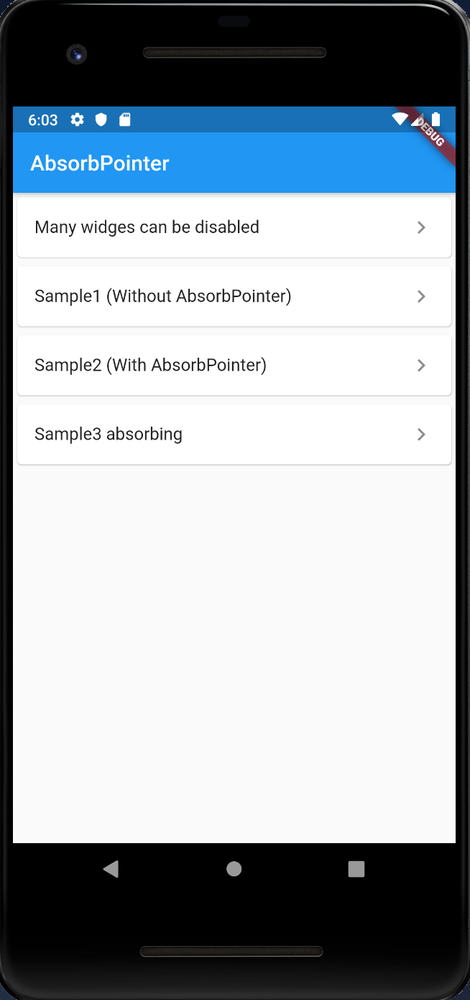
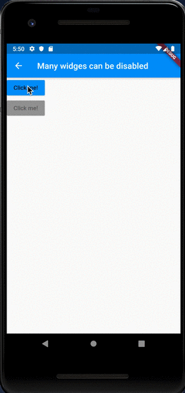
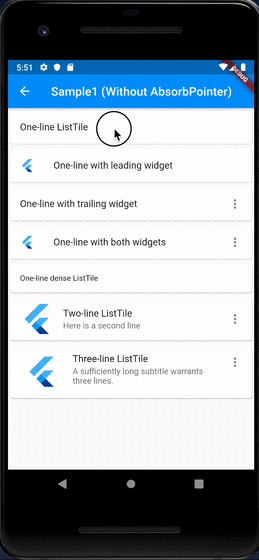
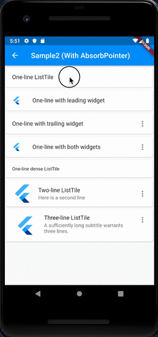
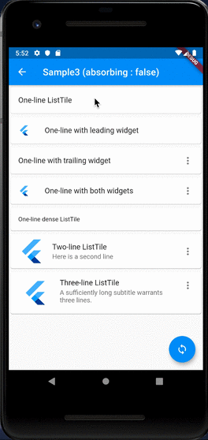

# AbsorbPointer

## Docs

[AbsorbPointer class](https://api.flutter.dev/flutter/widgets/AbsorbPointer-class.html)

[IgnorePointer class](https://api.flutter.dev/flutter/widgets/IgnorePointer-class.html)

## Screenshots

|Menu|Many widges can be disabled|
|:-:|:-:|
|||

|Sample1 (Without AbsorbPointer)|Sample2 (With AbsorbPointer)|Sample3 absorbing|
|:-:|:-:|:-:|
||||
