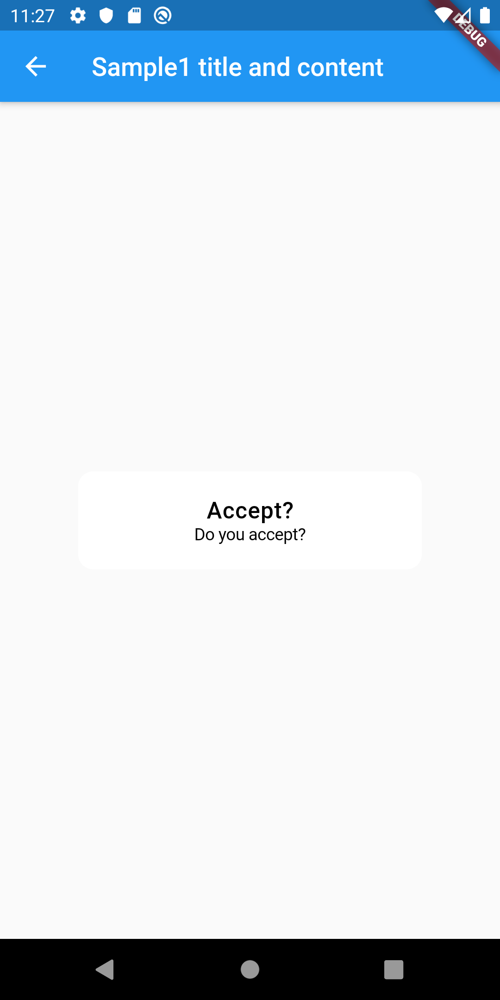
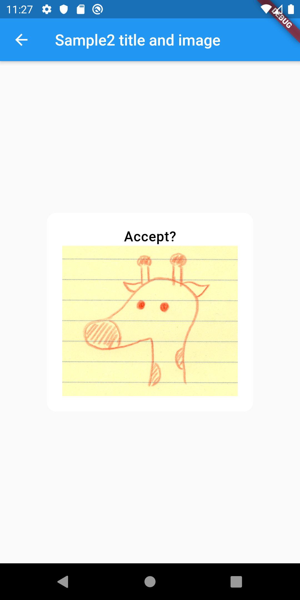
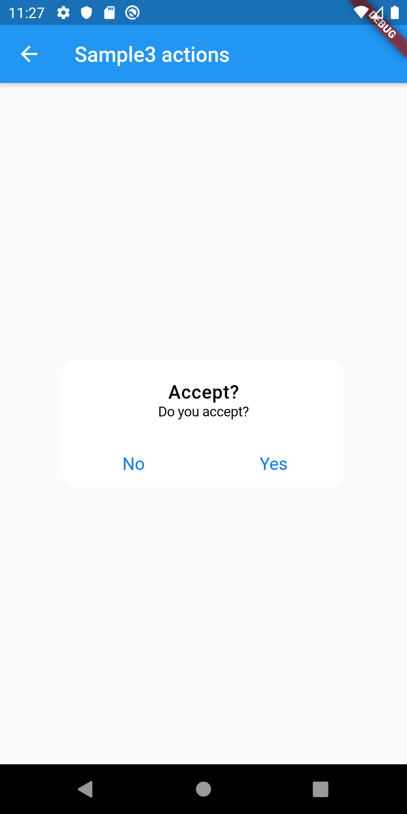
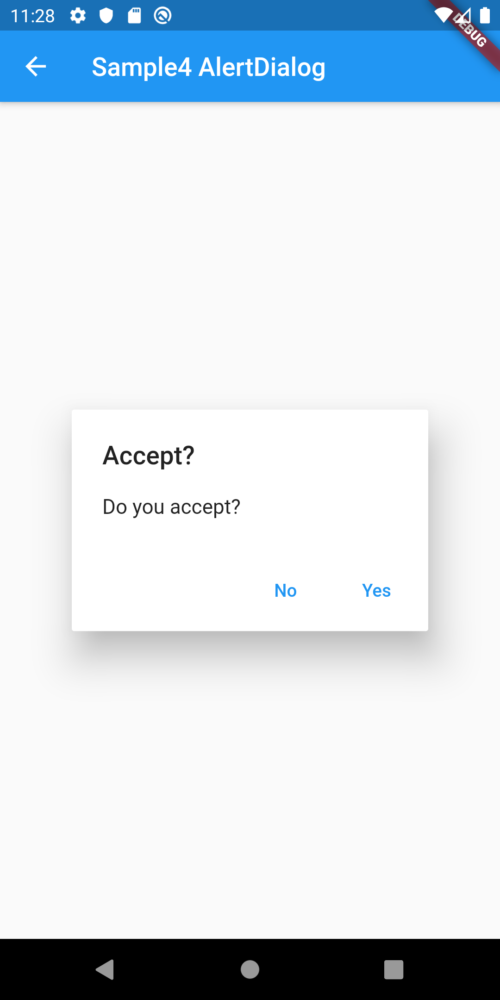
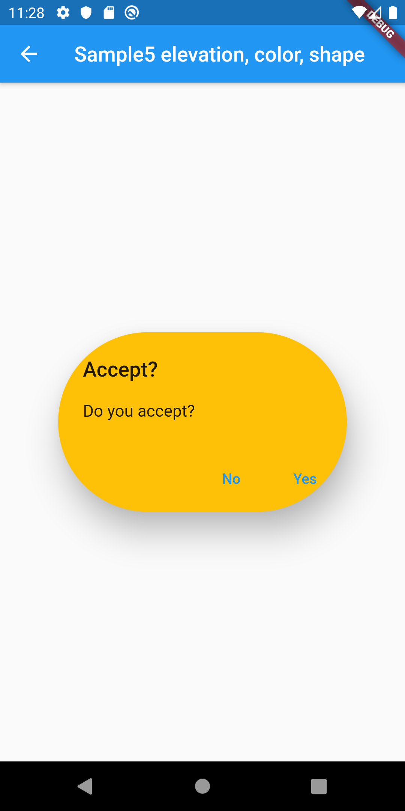
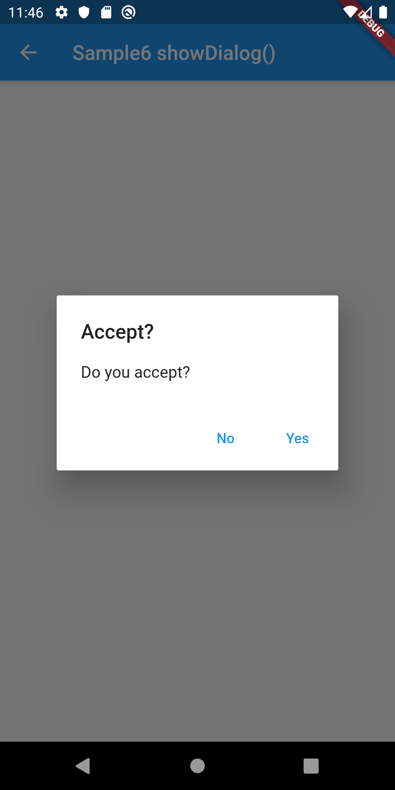
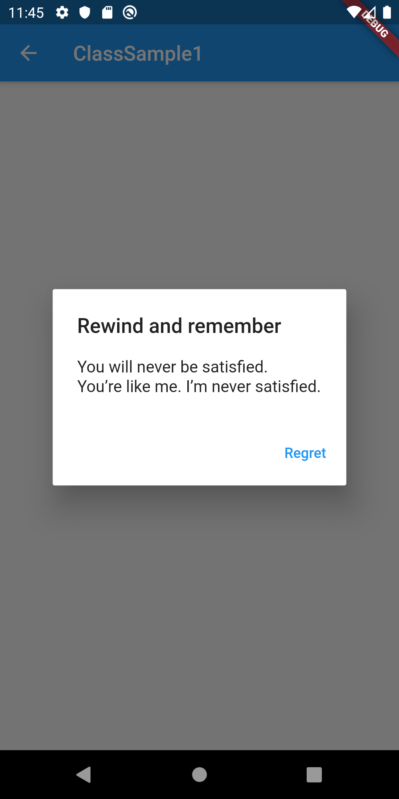

# AlertDialog

## Docs

[AlertDialog class](https://api.flutter.dev/flutter/material/AlertDialog-class.html)

[showDialog\<T\> function](https://api.flutter.dev/flutter/material/showDialog.html)

[showCupertinoDialog\<T\> function](https://api.flutter.dev/flutter/cupertino/showCupertinoDialog.html)

[showGeneralDialog\<T\> function](https://api.flutter.dev/flutter/widgets/showGeneralDialog.html)

[CupertinoAlertDialog class](https://api.flutter.dev/flutter/cupertino/CupertinoAlertDialog-class.html)

## Screenshots

|[Sample1](./lib/pages/sample1.dart)|[Sample2](./lib/pages/sample2.dart)|[Sample3](./lib/pages/sample3.dart)|
|:-:|:-:|:-:|
||||

|[Sample4](./lib/pages/sample4.dart)|[Sample5](./lib/pages/sample5.dart)|[Sample6](./lib/pages/sample6.dart)|
|:-:|:-:|:-:|
||||

|[ClassSample1](./lib/pages/class_sample1.dart)|
|:-:|
||