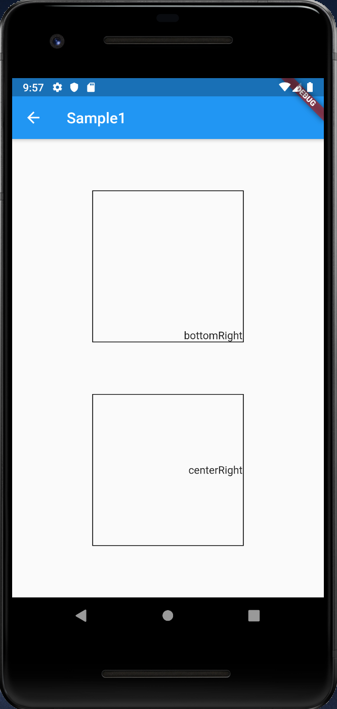
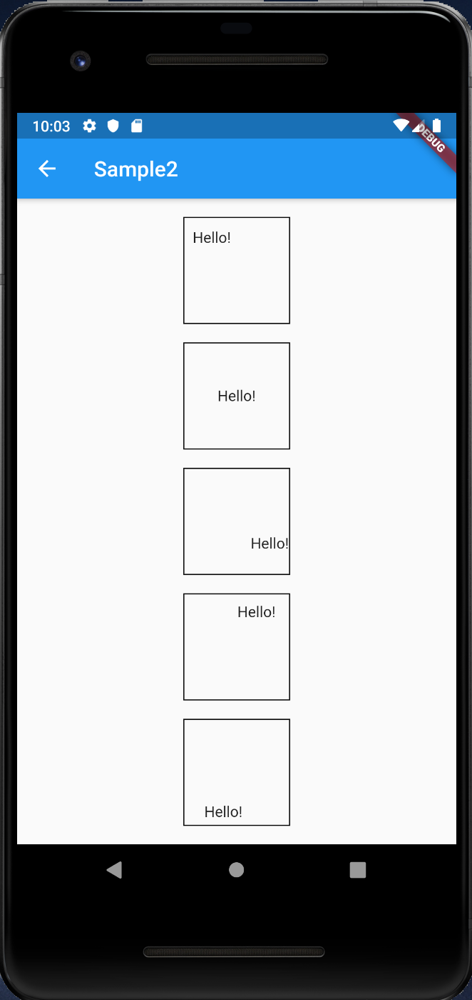
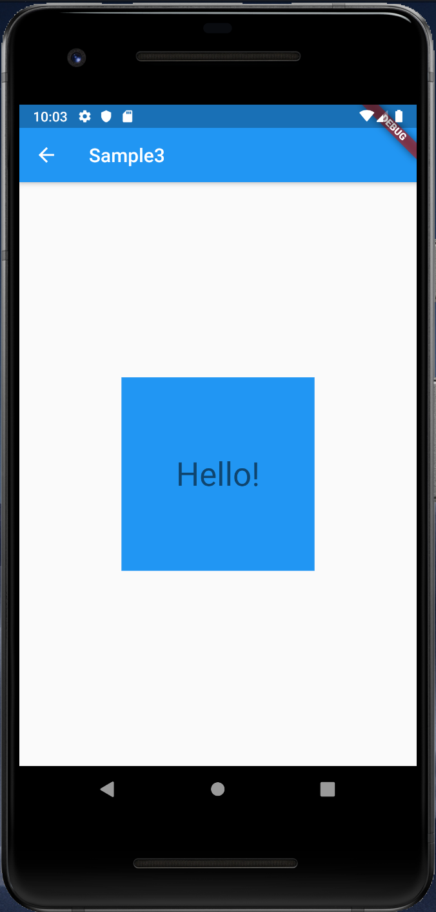

# Align

## Docs

[Align class](https://api.flutter.dev/flutter/widgets/Align-class.html)

## Screenshots

|[Sample1](lib/pages/sample1.dart)|[Sample2](lib/pages/sample2.dart)|[Sample3](lib/pages/sample3.dart)|
|:-:|:-:|:-:|
||||

|[Sample of Align class](lib/pages/sample_align_class.dart)|
|:-:|
||
