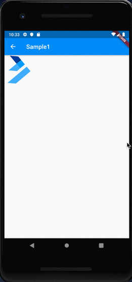
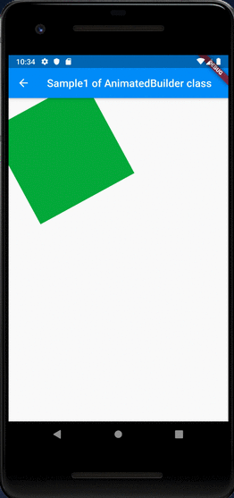

# AnimatedBuilder

## Docs

[AnimatedBuilder class](https://api.flutter.dev/flutter/widgets/AnimatedBuilder-class.html)

[Animation and motion widgets](https://flutter.dev/docs/development/ui/widgets/animation)

## Screenshots

|[Sample1](lib/pages/sample1.dart)|[Class Sample 1](lib/pages/class_sample1.dart)|
|:-:|:-:|
||
