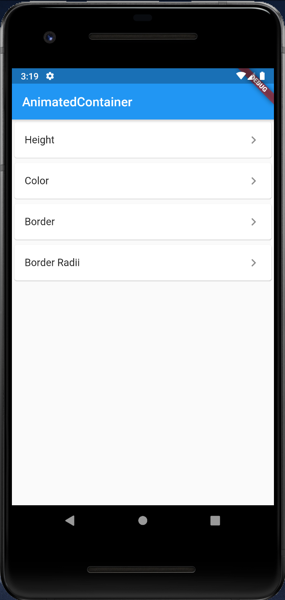
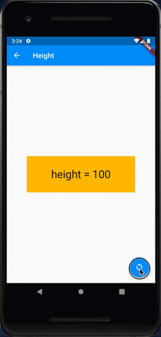
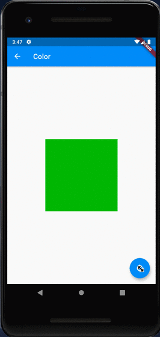
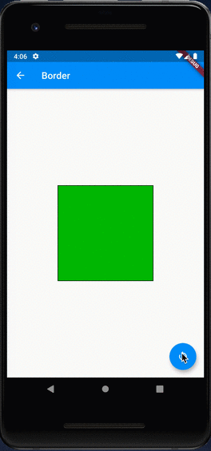
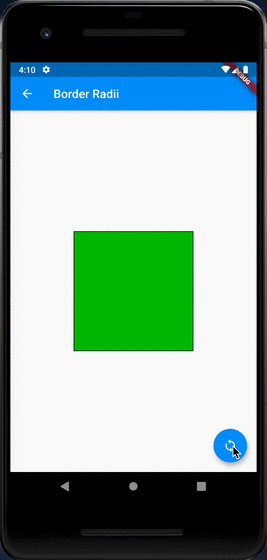

# AnimatedContainer

[AnimatedContainer class](https://api.flutter.dev/flutter/widgets/AnimatedContainer-class.html)

## Screenshots

Menu

|Height|Color|
|-|-|
|||

|Border|BorderRadii|
|-|-|
|||
