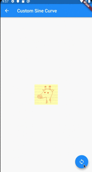

# AnimatedContainer

[AnimatedContainer class](https://api.flutter.dev/flutter/widgets/AnimatedContainer-class.html)

## Screenshots

|[Height](lib/pages/height.dart)|[Color](lib/pages/color.dart)|
|:-:|:-:|
|||

|[Border](lib/pages/border.dart)|[BorderRadii](lib/pages/border_raddii.dart)|
|:-:|:-:|
|||

|[Costom Sine Curve](lib/pages/sine_curve.dart)|
|:-:|
||
