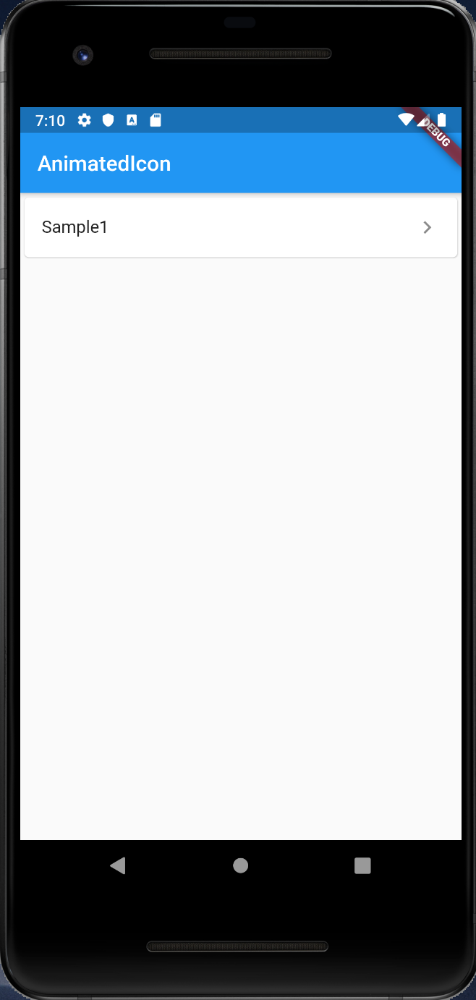

# AnimatedIcon

## Docs

[AnimatedIcon class](https://api.flutter.dev/flutter/material/AnimatedIcon-class.html)

[Icons](https://material.io/tools/icons/)

## Screenshots

|Menu|Sample1|
|:-:|:-:|
|||
