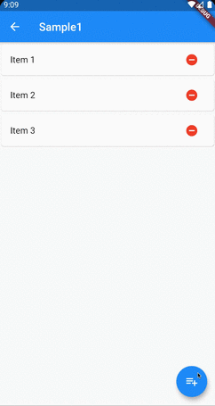
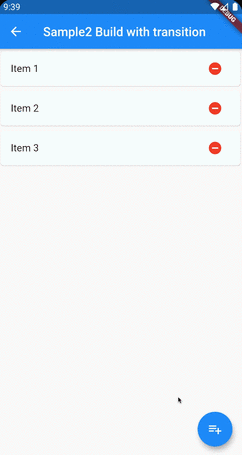
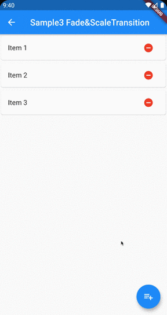

# AnimatedList

## Docs

[AnimatedList class](https://api.flutter.dev/flutter/widgets/AnimatedList-class.html)

[AnimatedList](https://flutter.dev/docs/catalog/samples/animated-list)

## Screenshots

|[Sample1](lib/pages/sample1.dart)|[Sample2 Build with transition](lib/pages/sample2.dart)|[Sample3 Fade&ScaleTransition](lib/pages/sample3.dart)|
|:-:|:-:|:-:|
||||
