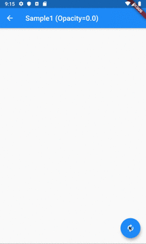
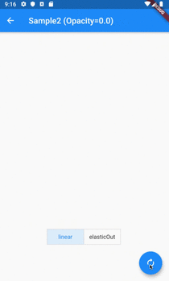
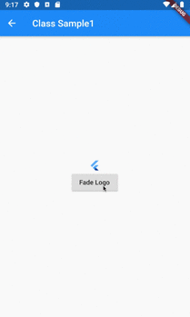

# AnimatedOpacity

## Docs

[AnimatedOpacity class](https://api.flutter.dev/flutter/widgets/AnimatedOpacity-class.html)

[FadeTransition class](https://api.flutter.dev/flutter/widgets/FadeTransition-class.html)

## Screenshots

|[Sample1](lib/pages/sample1.dart)|[Sample2](lib/pages/sample2.dart)|
|:-:|:-:|
|||

|[ClassSample1](lib/pages/class_sample1.dart)|
|:-:|
||