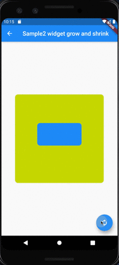

# AnimatedPositioned

## Docs

[AnimatedPositioned class](https://api.flutter.dev/flutter/widgets/AnimatedPositioned-class.html)

[Stack class](https://api.flutter.dev/flutter/widgets/Stack-class.html)

[SlideTransition class](https://api.flutter.dev/flutter/widgets/SlideTransition-class.html)

[Duration class](https://api.flutter.dev/flutter/dart-core/Duration-class.html)

## Screenshots

|[Sample1](lib/pages/sample1.dart)|[Sample2](lib/pages/sample2.dart)|
|:-:|:-:|
|||
