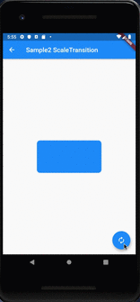
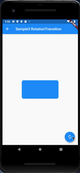
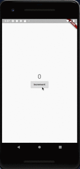

# AnimatedSwitcher

## Docs

[AnimatedSwitcher class](https://api.flutter.dev/flutter/widgets/AnimatedSwitcher-class.html)

[FadeTransition class](https://api.flutter.dev/flutter/widgets/FadeTransition-class.html)

[ScaleTransition class](https://api.flutter.dev/flutter/widgets/ScaleTransition-class.html)

[RotationTransition class](https://api.flutter.dev/flutter/widgets/RotationTransition-class.html)

[LayoutBuilder class](https://api.flutter.dev/flutter/widgets/LayoutBuilder-class.html)

## Screenshots

|Sample1|Sample2 ScaleTransition|Sample3 RotationTransition|
|:-:|:-:|:-:|
||||

|Sample4 layoutBuilder|Sample|
|:-:|:-:|
|||