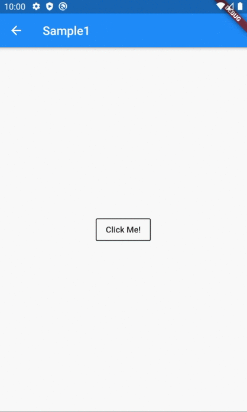

# AnimatedWidget

## Docs

[AnimatedWidget class](https://api.flutter.dev/flutter/widgets/AnimatedWidget-class.html)

[DartPad](https://dartpad.dartlang.org/f5df45f7cdea418665471aea49454750)

## Screenshots

|[Sample1](lib/pages/sample1.dart)|[ClassSample1](lib/pages/class_sample1.dart)|
|:-:|:-:|
|||
