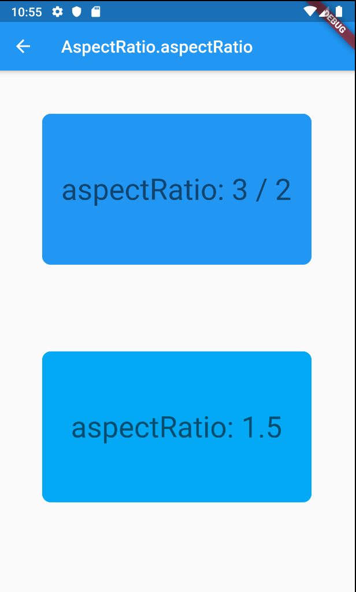
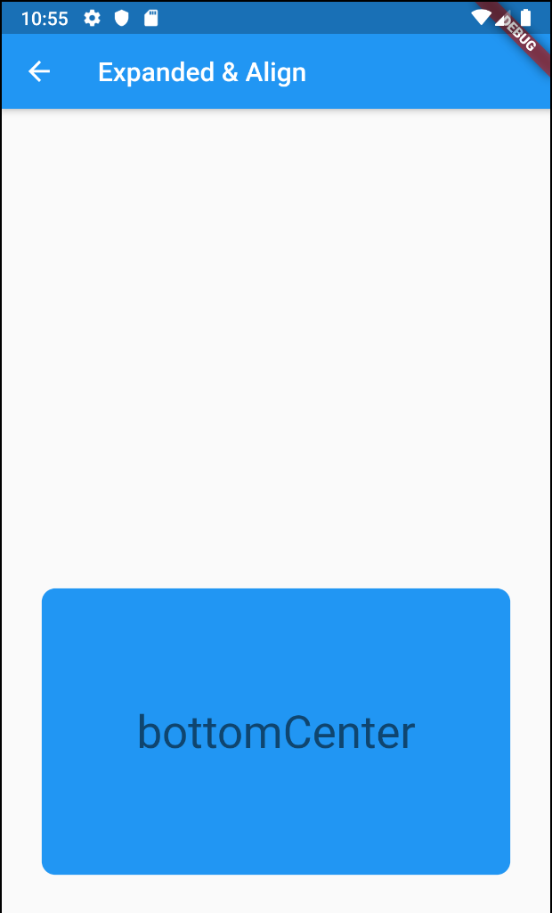

# AspectRatio

## Docs

[AspectRatio class](https://api.flutter.dev/flutter/widgets/AspectRatio-class.html)

## Screenshots

|[Sample1 AspectRatio.aspectRatio](lib/pages/sample1.dart)|[Sample2 Expanded & Align](lib/pages/sample2.dart)|
|:-:|:-:|
|||
