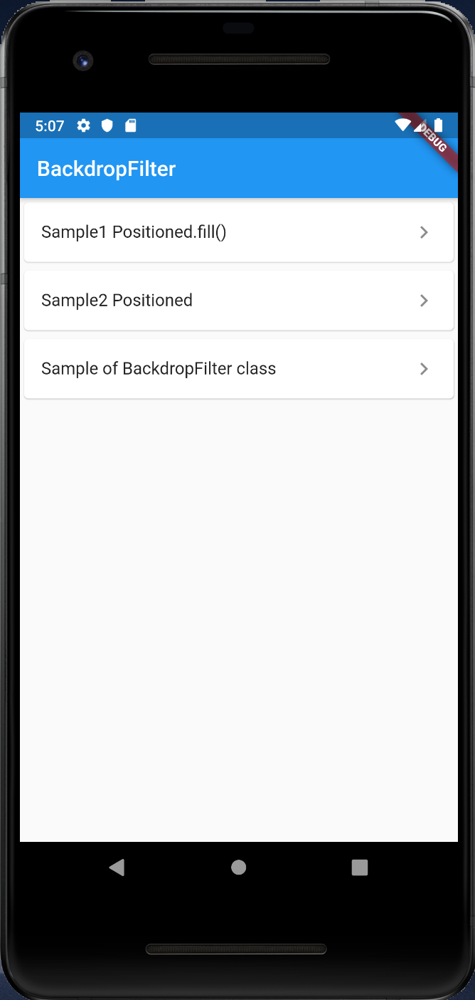

# BackdropFilter

## Docs

[BackdropFilter class](https://api.flutter.dev/flutter/widgets/BackdropFilter-class.html)

[ImageFilter class](https://api.flutter.dev/flutter/dart-ui/ImageFilter-class.html)

## Screenshots

|Menu|
|:-:|
||

|Sample1 Positioned.fill()|Sample2 Positioned|Sample of BackdropFilter class|
|:-:|:-:|:-:|
||||
