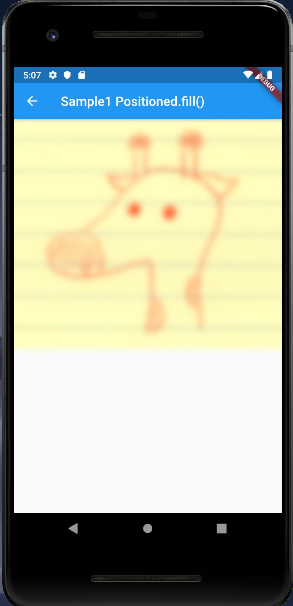
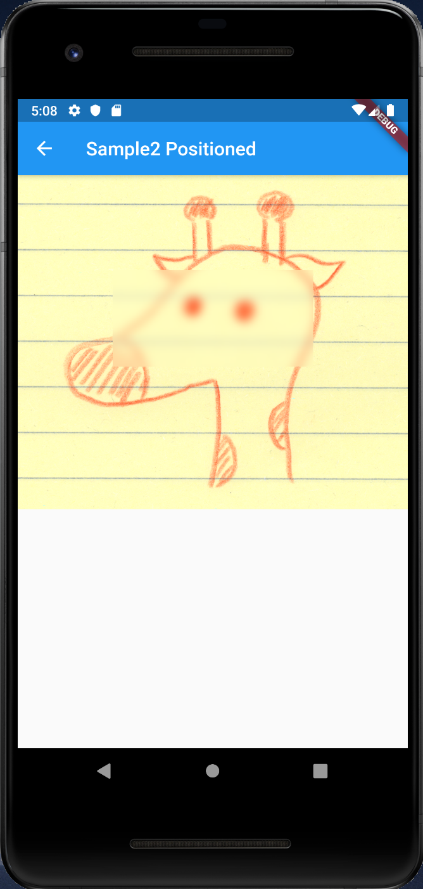
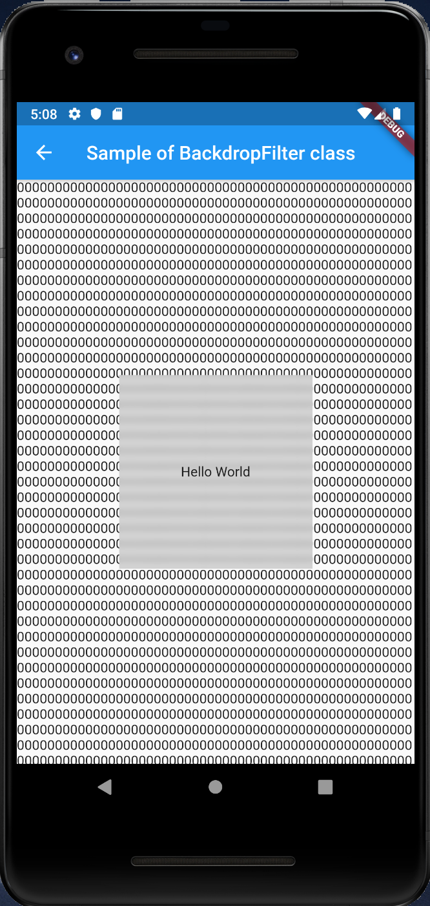

# BackdropFilter

## Docs

[BackdropFilter class](https://api.flutter.dev/flutter/widgets/BackdropFilter-class.html)

[ImageFilter class](https://api.flutter.dev/flutter/dart-ui/ImageFilter-class.html)

## Screenshots

|[Sample1 Positioned.fill()](lib/pages/sample1.dart)|[Sample2 Positioned](lib/pages/sample2.dart)|[Sample of BackdropFilter class](lib/pages/sample3.dart)|
|:-:|:-:|:-:|
||||
