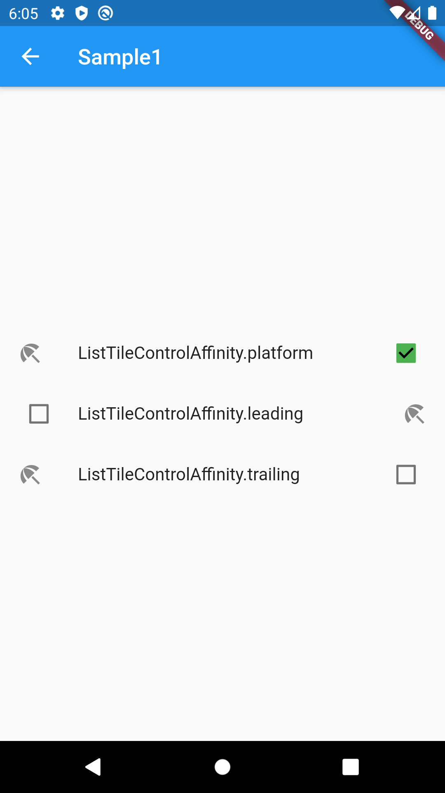
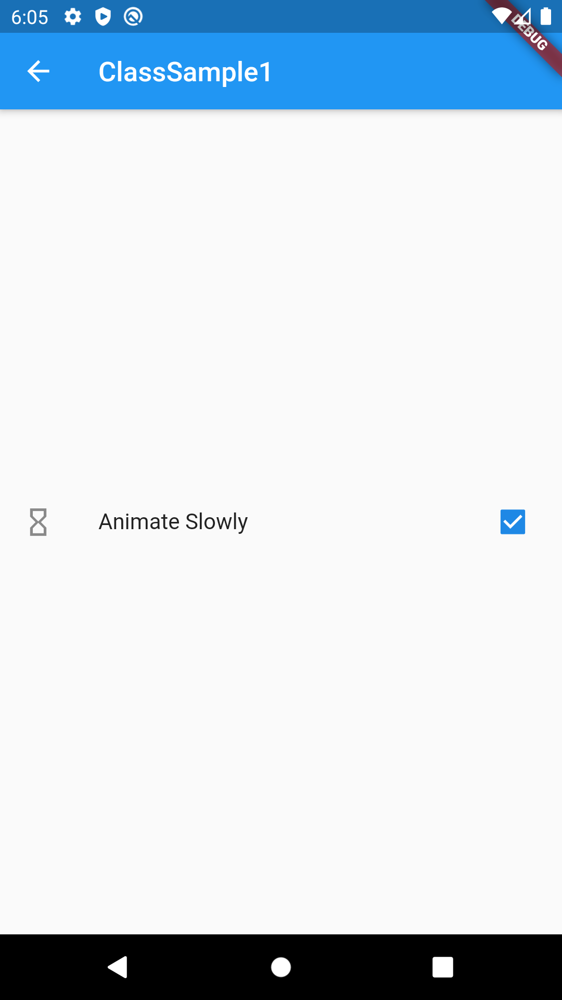
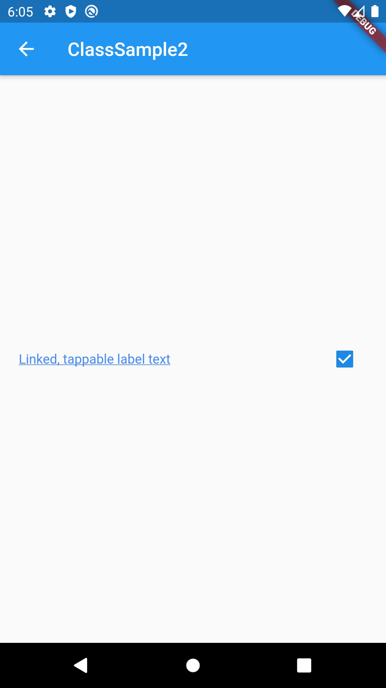
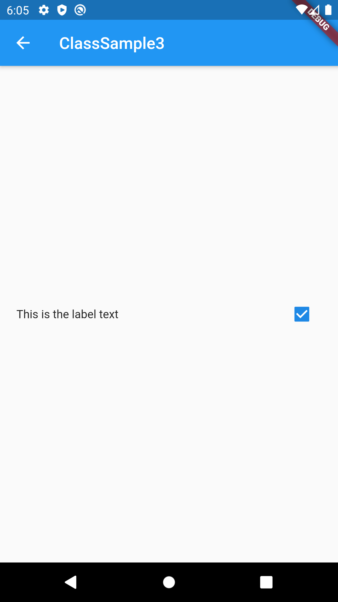

# CheckboxListTile

## Docs

[CheckboxListTile class](https://api.flutter.dev/flutter/material/CheckboxListTile-class.html)

[DartPad](https://dartpad.dartlang.org/071176d8f90b50f3503c80506d898325)

## Screenshots

|[Sample1](lib/pages/sample1.dart)|
|:-:|
||

|[ClassSample1](./lib/pages/class_sample1.dart)|[ClassSample2](./lib/pages/class_sample2.dart)|[ClassSample3](./lib/pages/class_sample3.dart)|
|:-:|:-:|:-:|
||||
