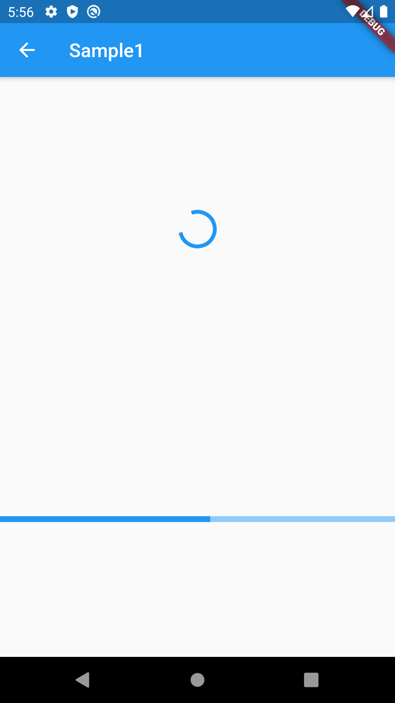
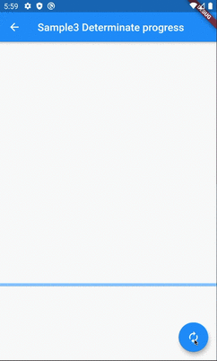
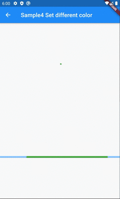
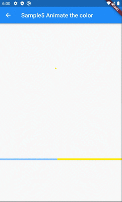
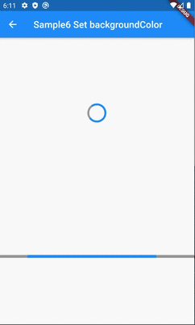
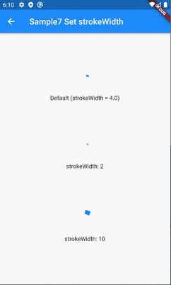

# CircularProgressIndicator and LinearProgressIndicator

## Docs

[CircularProgressIndicator class](https://api.flutter.dev/flutter/material/CircularProgressIndicator-class.html)

[LinearProgressIndicator class](https://api.flutter.dev/flutter/material/LinearProgressIndicator-class.html)

[DartPad](https://dartpad.dev/d460887ddeae943e2cfc899ab2c0e248)

## Screenshots

|[Sample1](lib/pages/sample1.dart)|[Sample2](lib/pages/sample2.dart)|[Sample3](lib/pages/sample3.dart)|
|:-:|:-:|:-:|
||||

|[Sample4](lib/pages/sample4.dart)|[Sample5](lib/pages/sample5.dart)|[Sample6](lib/pages/sample6.dart)|
|:-:|:-:|:-:|
||||

|[Sample7](lib/pages/sample7.dart)|
|:-:|
||
