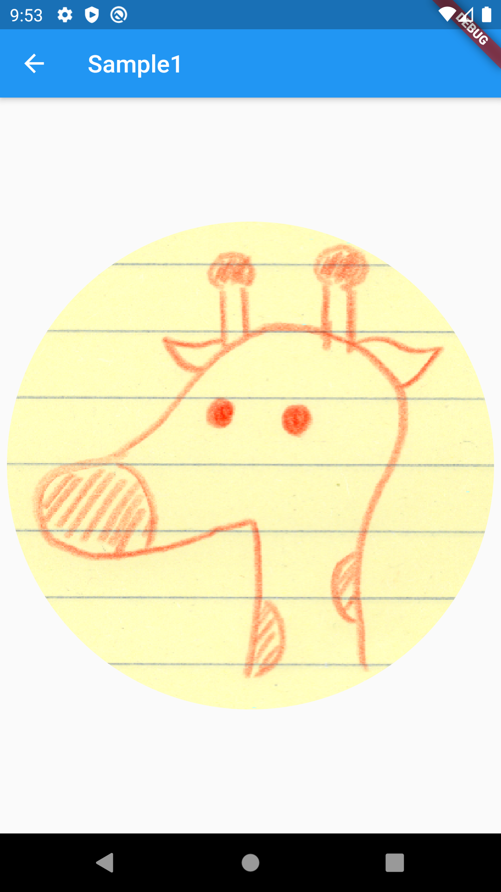
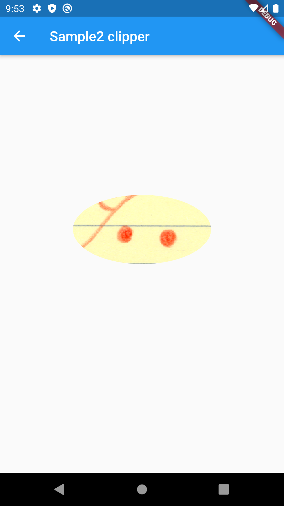
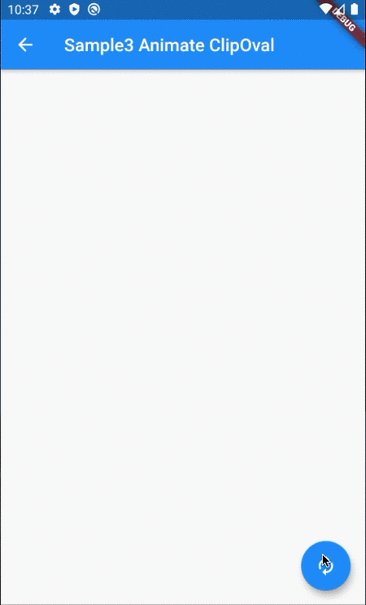

# ClipOval

## Docs

[ClipOval class](https://api.flutter.dev/flutter/widgets/ClipOval-class.html)

[DartPad](https://dartpad.dartlang.org/3d6a99cbdb1b75d1d3d93e2e472b488c)

## Screenshots

|[Sample1](lib/pages/sample1.dart)|[Sample2](lib/pages/sample2.dart)|
|:-:|:-:|
|||

|[Sample3](lib/pages/sample3.dart)|
|:-:|
||
