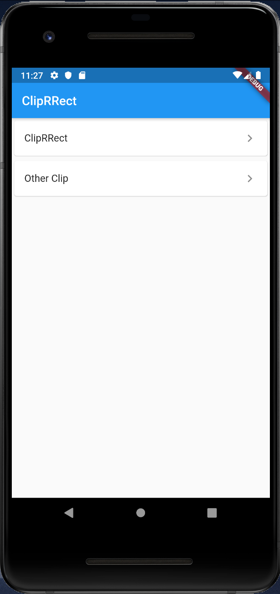
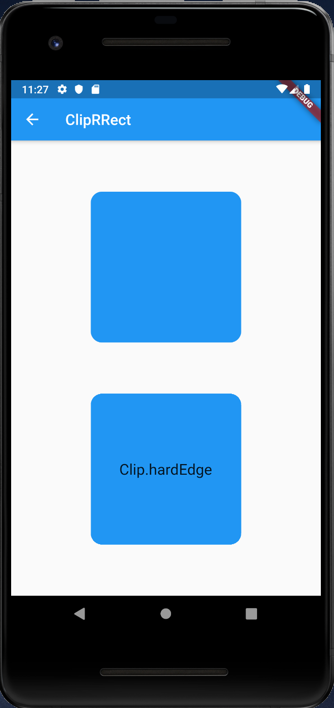
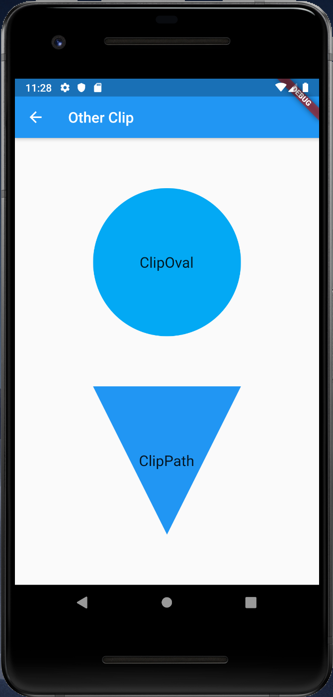

# ClipRRect

## Docs

[ClipRRect class](https://api.flutter.dev/flutter/widgets/ClipRRect-class.html)

[ClipOval class](https://api.flutter.dev/flutter/widgets/ClipOval-class.html)

[ClipPath class](https://api.flutter.dev/flutter/widgets/ClipPath-class.html)

## Screenshots

|Menu|ClipRRect|OtherClip|
|-|-|-|
||||
