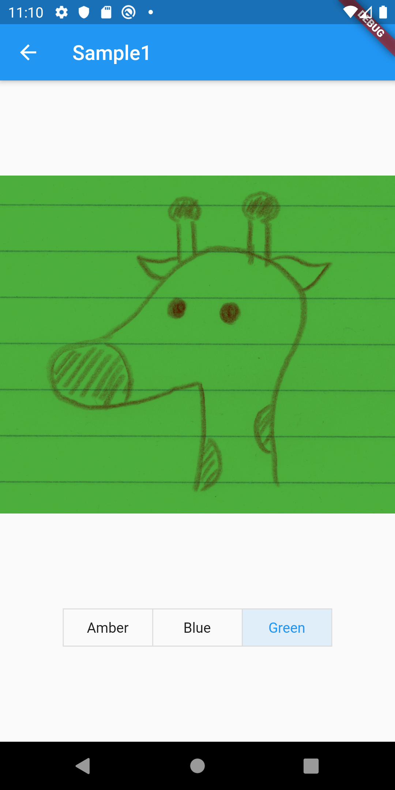

# ColorFiltered

## Docs

[ColorFiltered class](https://api.flutter.dev/flutter/widgets/ColorFiltered-class.html)

[ColorFilter class](https://api.flutter.dev/flutter/dart-ui/ColorFilter-class.html)

[BlendMode enum](https://api.flutter.dev/flutter/dart-ui/BlendMode-class.html)

[csells/flutter_color_filter](https://github.com/csells/flutter_color_filter)

## Screenshots

|[Sample1](./lib/pages/sample1.dart)|
|:-:|
||
