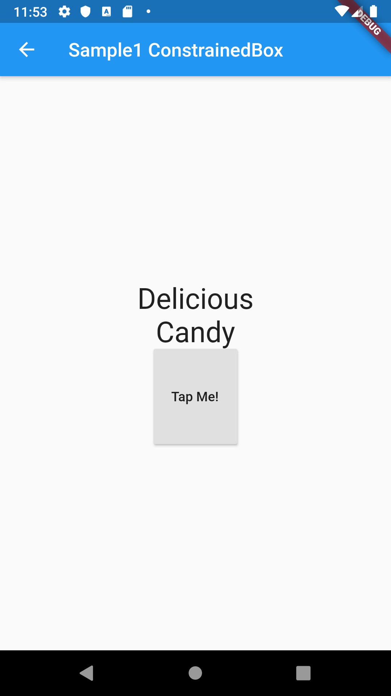
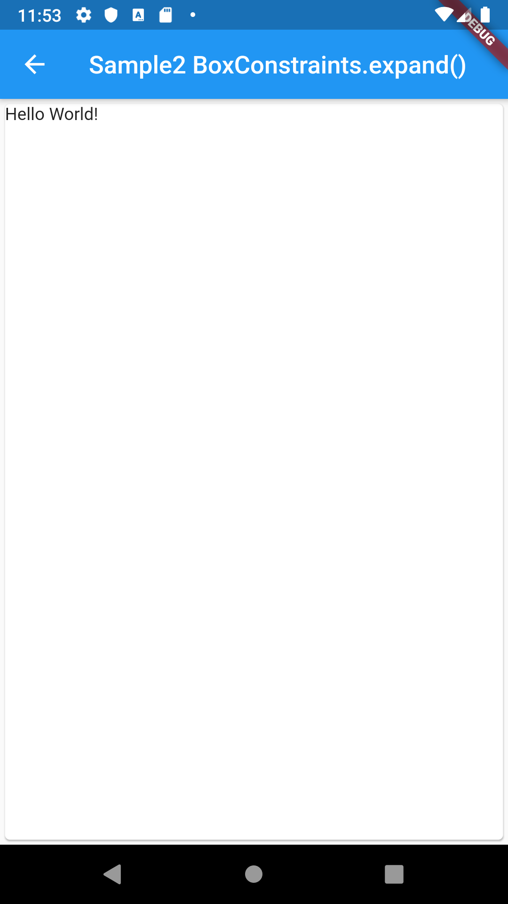

# ConstrainedBox

## Docs

[ConstrainedBox class](https://api.flutter.dev/flutter/widgets/ConstrainedBox-class.html)

[BoxConstraints class](https://api.flutter.dev/flutter/rendering/BoxConstraints-class.html)

[UnconstrainedBox class](https://api.flutter.dev/flutter/widgets/UnconstrainedBox-class.html)

## Screenshots

|Sample1|Sample2|
|:-:|:-:|
|||