# Container

## Docs

[Container class](https://api.flutter.dev/flutter/widgets/Container-class.html)

[Layout widgets](https://flutter.dev/docs/development/ui/widgets/layout)

[Basic Flutter layout concepts](https://flutter.dev/docs/codelabs/layout-basics)

## Screenshots

|[Sample1](./lib/pages/sample1.dart)|[Sample2](./lib/pages/sample2.dart)|[Sample3](./lib/pages/sample3.dart)|
|:-:|:-:|:-:|
|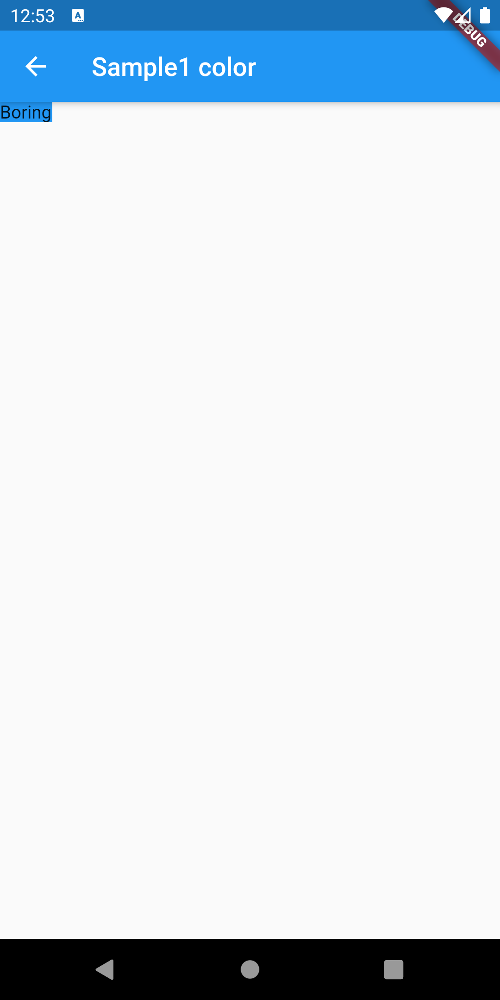|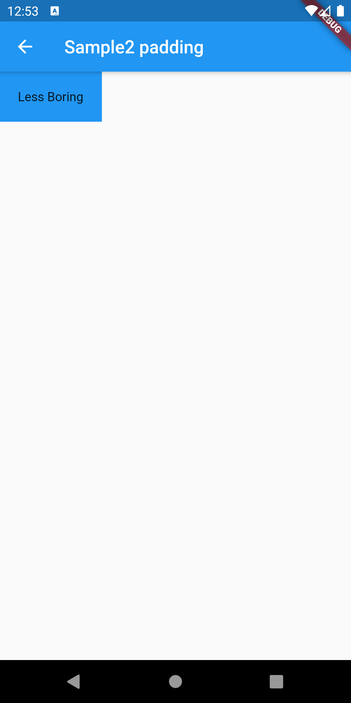|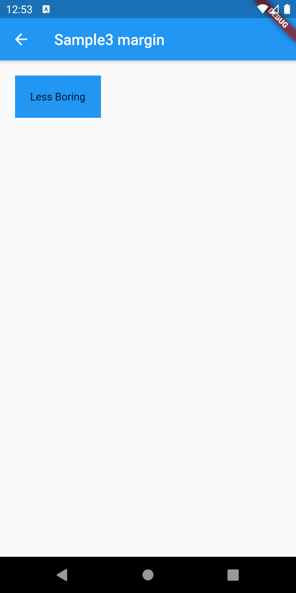|

|[Sample4](./lib/pages/sample4.dart)|[Sample5](./lib/pages/sample5.dart)|[Sample6](./lib/pages/sample6.dart)|
|:-:|:-:|:-:|
|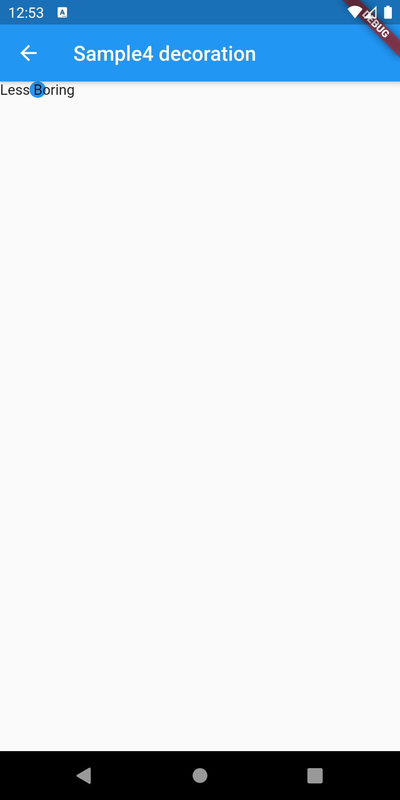|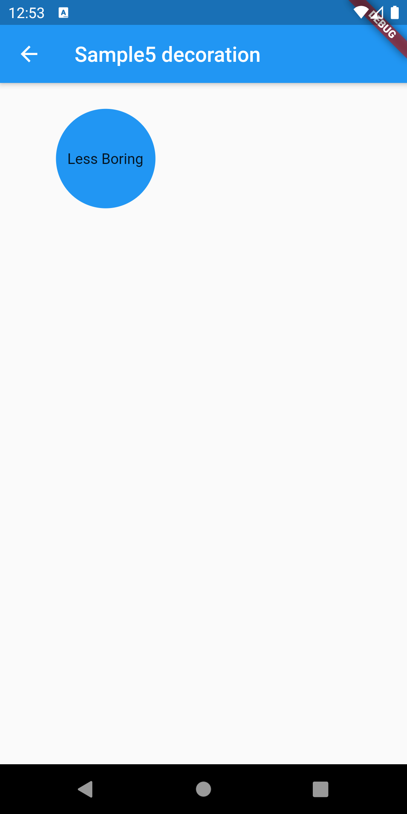|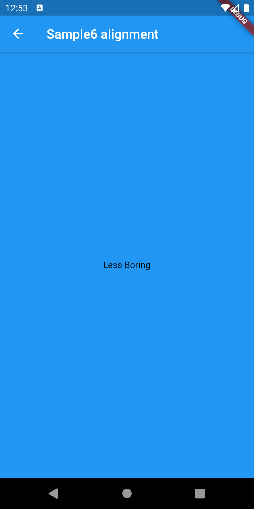|

|[Sample7](./lib/pages/sample7.dart)|[Sample8](./lib/pages/sample8.dart)|[Sample9](./lib/pages/sample9.dart)|
|:-:|:-:|:-:|
|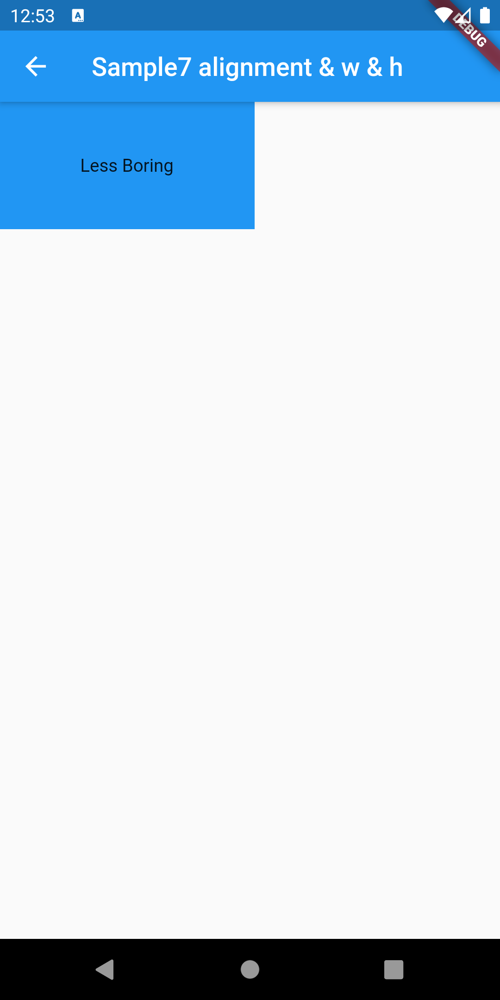|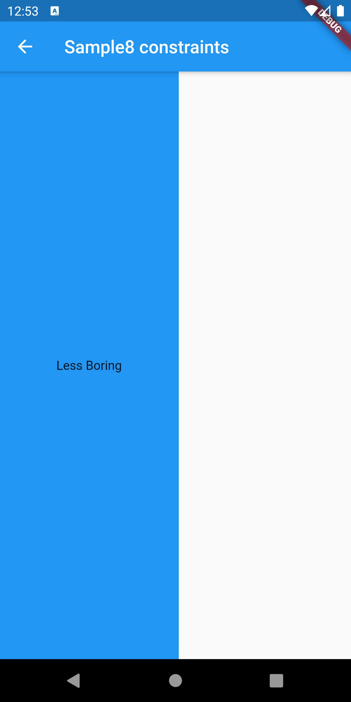|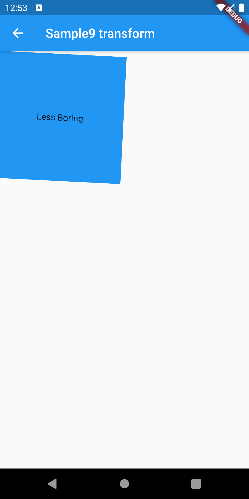|

|[ClassSample1](./lib/pages/class_sample1.dart)|[ClassSample2](./lib/pages/class_sample2.dart)|
|:-:|:-:|
|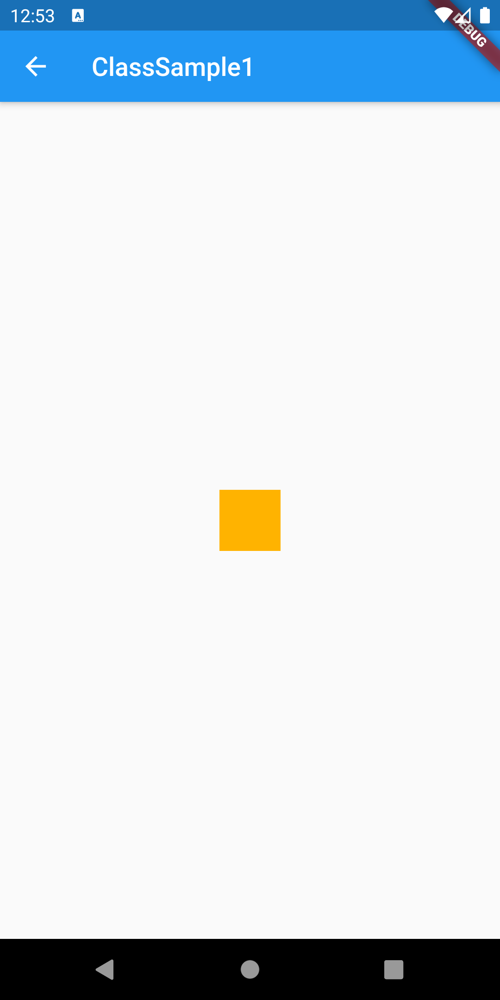|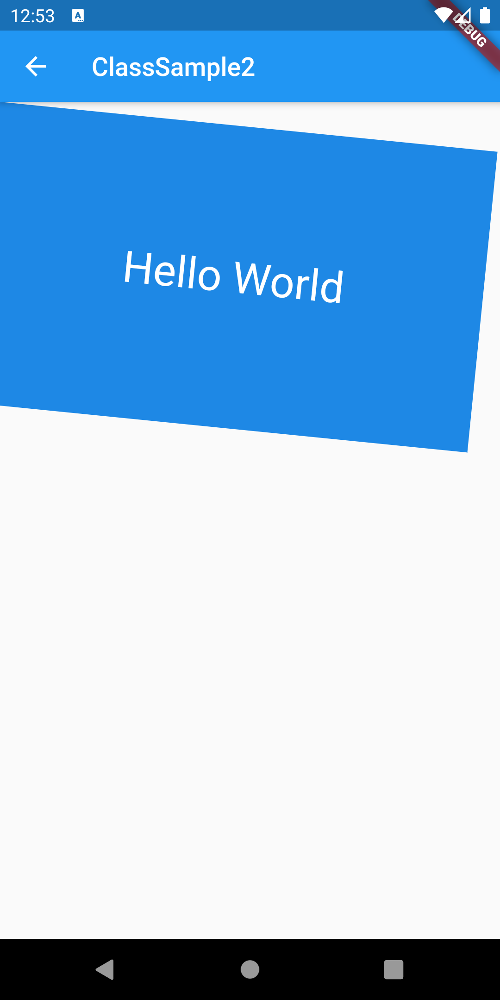|
