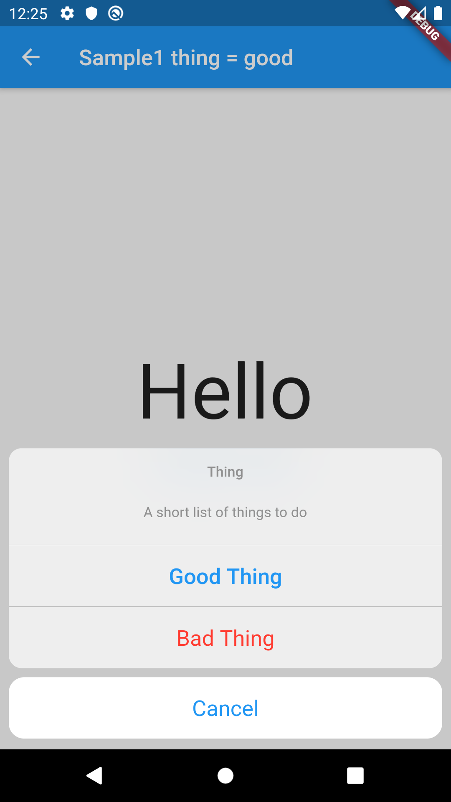

# CupertinoActionSheet

## Docs

[CupertinoActionSheet class](https://api.flutter.dev/flutter/cupertino/CupertinoActionSheet-class.html)

[CupertinoActionSheetAction class](https://api.flutter.dev/flutter/cupertino/CupertinoActionSheetAction-class.html)

## Screenshots

|[Sample1](./lib/pages/sample1.dart)|
|:-:|:-
||
