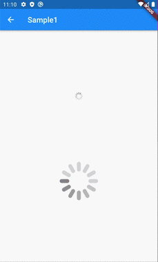
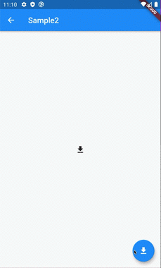

# CupertinoActivityIndicator

## Docs

[CupertinoActivityIndicator class](https://api.flutter.dev/flutter/cupertino/CupertinoActivityIndicator-class.html)

[FutureBuilder\<T\> class](https://api.flutter.dev/flutter/widgets/FutureBuilder-class.html)

## Screenshots

|[Sample1](lib/pages/sample1.dart)|[Sample2](lib/pages/sample2.dart)|
|:-:|:-:|
|||
