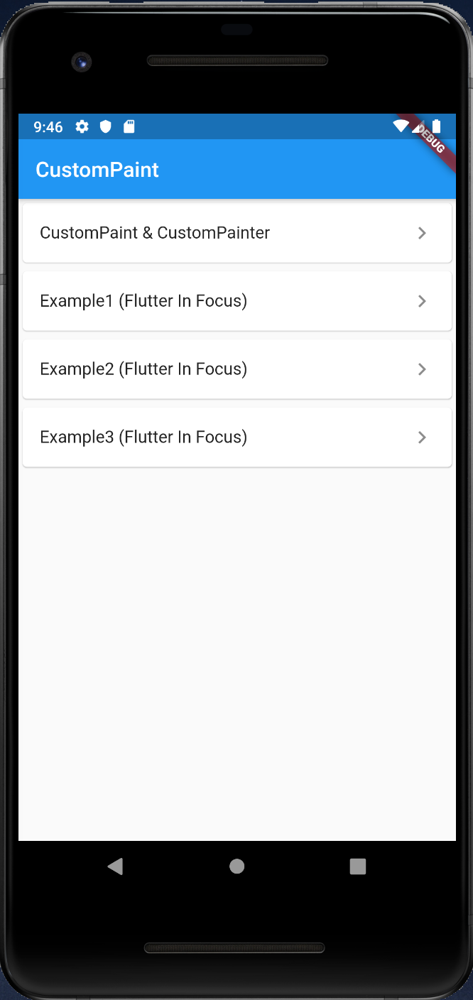
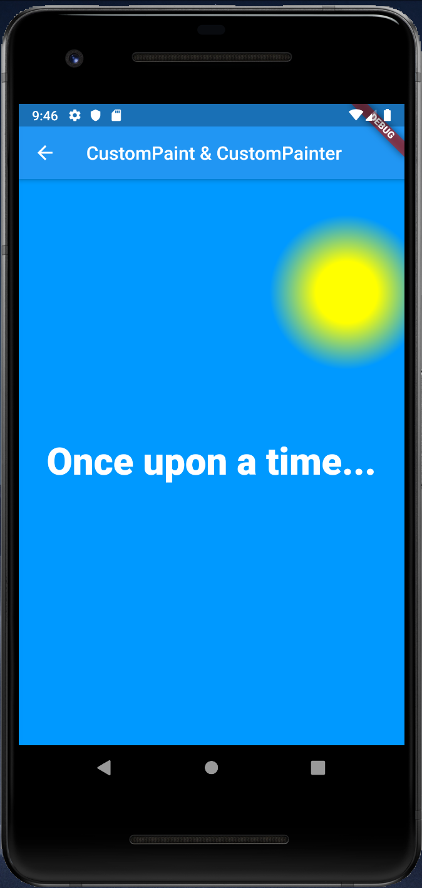
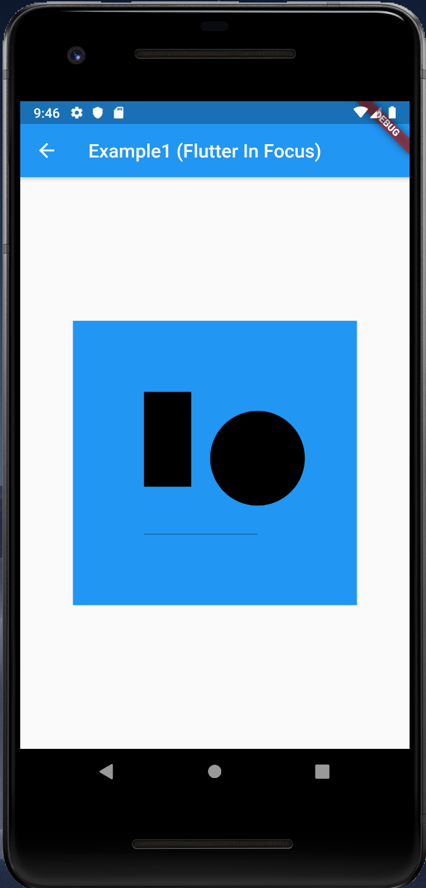
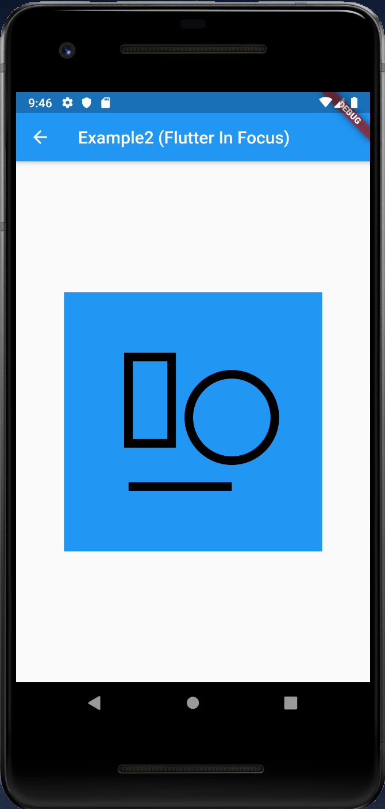
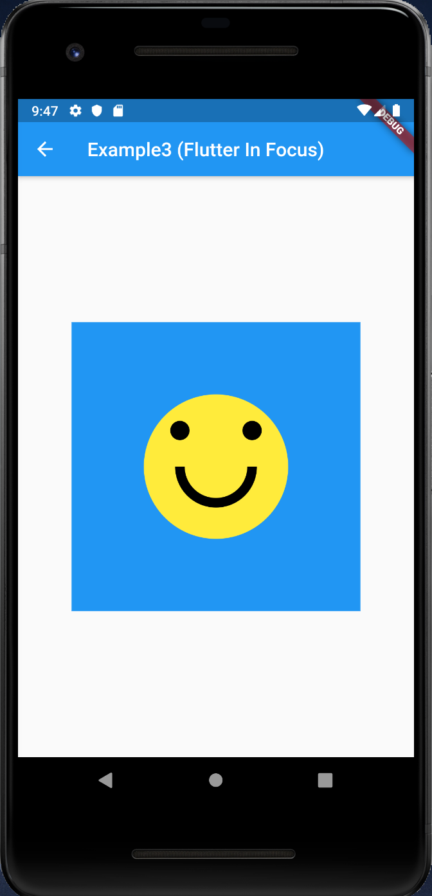

# CustomPaint

## Docs

[CustomPaint class](https://api.flutter.dev/flutter/widgets/CustomPaint-class.html)

[CustomPainter class](https://api.flutter.dev/flutter/rendering/CustomPainter-class.html)

[Canvas class](https://api.flutter.dev/flutter/dart-ui/Canvas-class.html)

[Custom painting in Flutter - Flutter In Forcus](https://youtu.be/vvI_NUXK00s)

## Screenshots

|Menu|CustomPaint_CustomPainter|
|-|-|
|||

|Example1|Example2|Example3|
|-|-|-|
||||