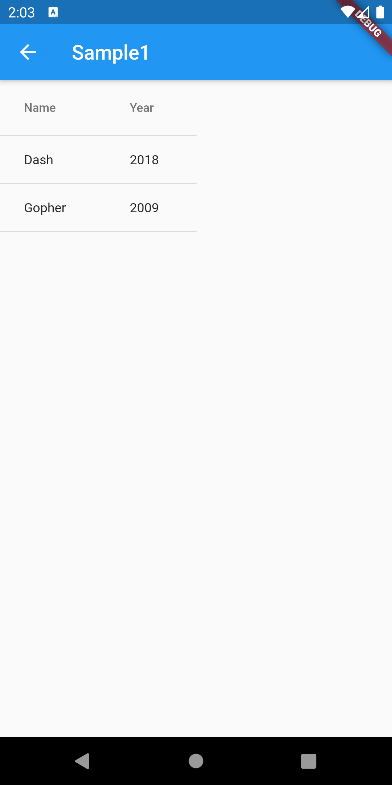
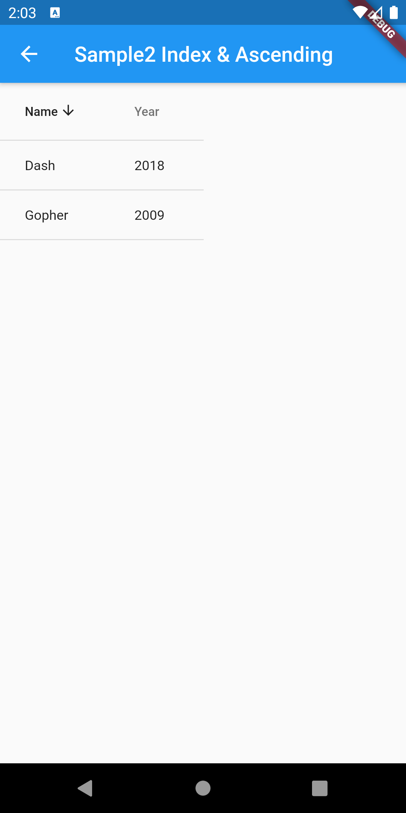
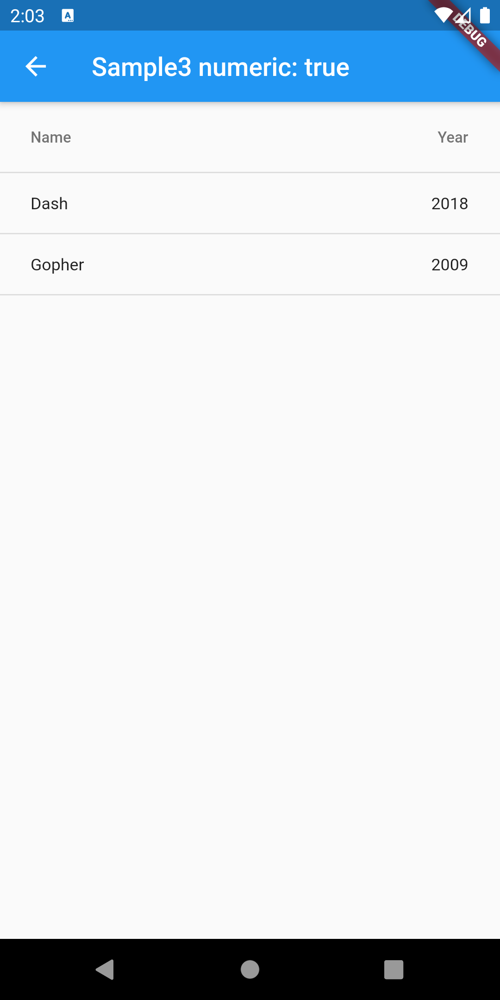
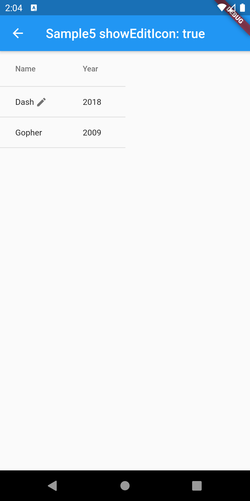
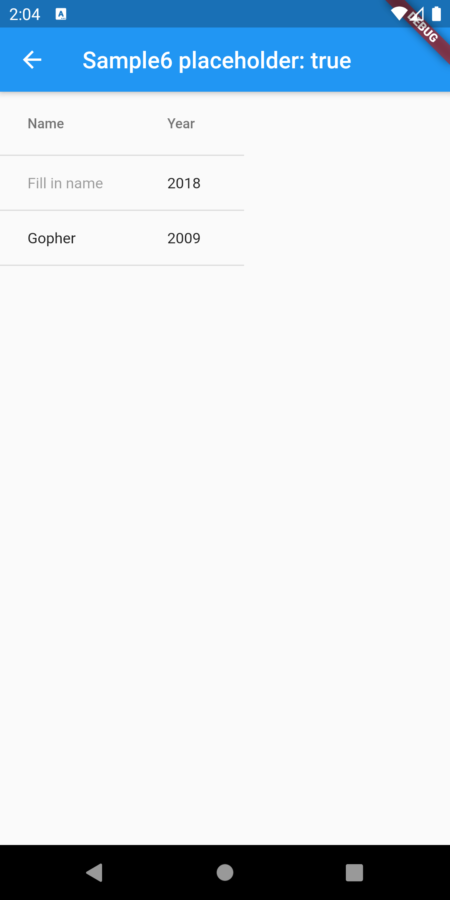
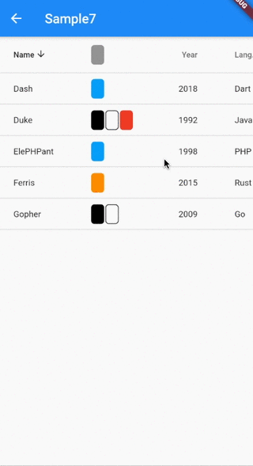

# DataTable

## Docs

[DataTable class](https://api.flutter.dev/flutter/material/DataTable-class.html)

## Screenshots

|[Sample1](./lib/pages/sample1.dart)|[Sample2](./lib/pages/sample2.dart)|[Sample3](./lib/pages/sample3.dart)|
|:-:|:-:|:-:|
||||

|[Sample4](./lib/pages/sample4.dart)|[Sample5](./lib/pages/sample5.dart)|[Sample6](./lib/pages/sample6.dart)|
|:-:|:-:|:-:|
||||

|[Sample7](./lib/pages/sample7.dart)||
|:-:|:-:|
|||