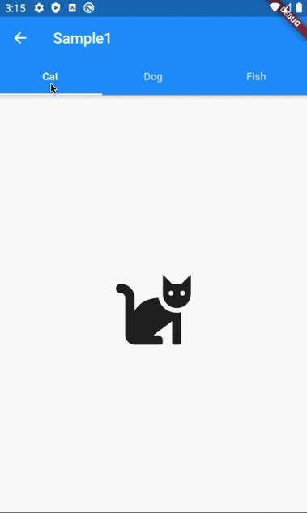

# DefaultTabController & TabBar

## Docs

[DefaultTabController class](https://api.flutter.dev/flutter/material/DefaultTabController-class.html)

[TabBar class](https://api.flutter.dev/flutter/material/TabBar-class.html)

[TabBarView class](https://api.flutter.dev/flutter/material/TabBarView-class.html)

## Screenshots

|[Sample1](./lib/pages/sample1.dart)|[ClassSample1](./lib/pages/class_sample1.dart)|
|:-:|:-:|
|||

