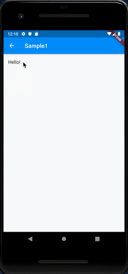
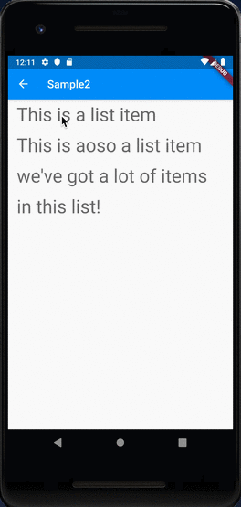
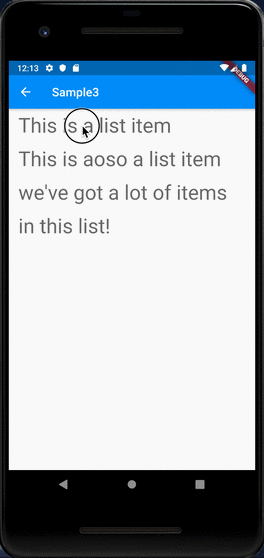
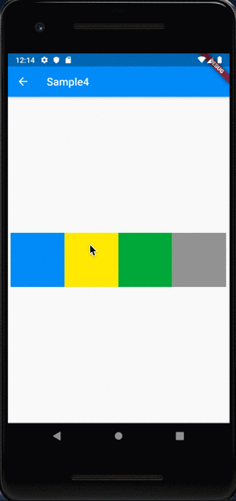
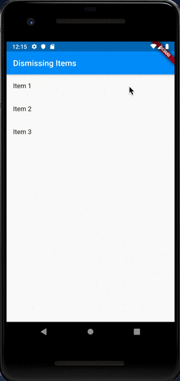

# Dismissible

## Docs

[Dismissible class](https://api.flutter.dev/flutter/widgets/Dismissible-class.html)

[Implement swipe to dismiss (cookbook)](https://flutter.dev/docs/cookbook/gestures/dismissible)

## Screenshots

|[Sample1](lib/pages/sample1.dart)|[Sample2](lib/pages/sample2.dart)|[Sample3](lib/pages/sample3.dart)|
|:-:|:-:|:-:|
||||

|[Sample4](lib/pages/sample4.dart)|[Sample of Cookbook](lib/pages/sample_cookbook.dart)|
|:-:|:-:|
|||
