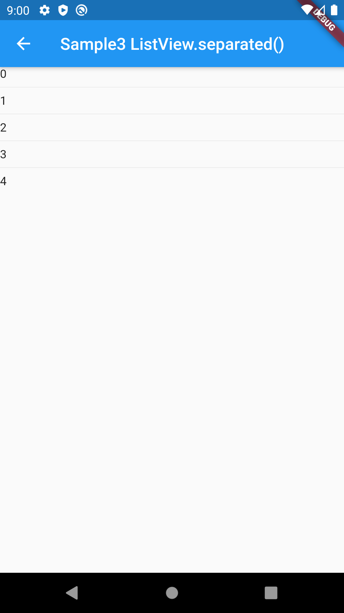

# Divider

## Docs

[Divider class](https://api.flutter.dev/flutter/material/Divider-class.html)

[ListView.separated constructor](https://api.flutter.dev/flutter/widgets/ListView/ListView.separated.html)

[divideTiles method](https://api.flutter.dev/flutter/material/ListTile/divideTiles.html)

[DartPad](https://dartpad.dev/43fca167fd0a42d3d9bca8daf6e456a2)

## Screenshots

|[Sample1](lib/pages/sample1.dart)|[Sample2](lib/pages/sample2.dart)|[Sample3](lib/pages/sample3.dart)|
|:-:|:-:|:-:|
||||

|[Sample4](lib/pages/sample4.dart)|
|:-:|
||