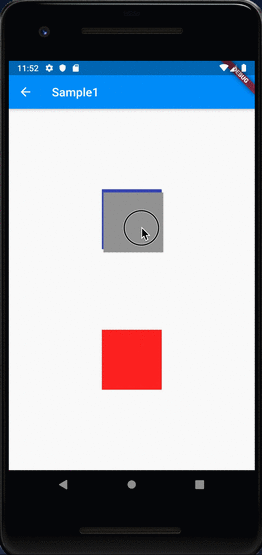
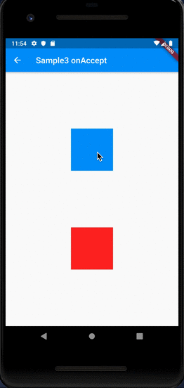
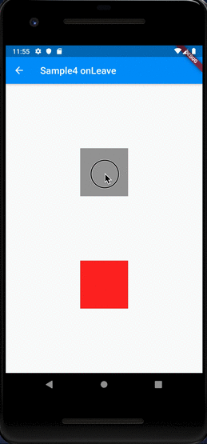

# Draggable

## Docs

[Draggable\<T\> class](https://api.flutter.dev/flutter/widgets/Draggable-class.html)

[DragTarget\<T\> class](https://api.flutter.dev/flutter/widgets/DragTarget-class.html)

## Screenshots

|[Sample1](lib/pages/sample1.dart)|[Sample2 onWillAccept](lib/pages/sample2.dart)|
|:-:|:-:|
|||

|[Sample3 onAccept](lib/pages/sample3.dart)|[Sample4 onLeave](lib/pages/sample4.dart)|
|:-:|:-:|
|||
