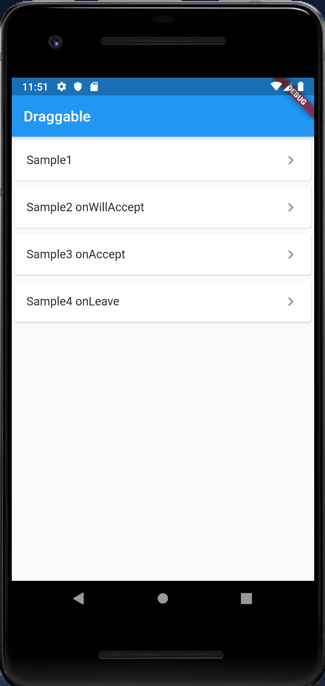

# Draggable

## Docs

[Draggable\<T\> class](https://api.flutter.dev/flutter/widgets/Draggable-class.html)

[DragTarget\<T\> class](https://api.flutter.dev/flutter/widgets/DragTarget-class.html)

## Screenshots

|Menu|Sample1|Sample2 onWillAccept|
|:-:|:-:|:-:|
||||

|Sample3 onAccept|Sample4 onLeave|
|:-:|:-:|
|||