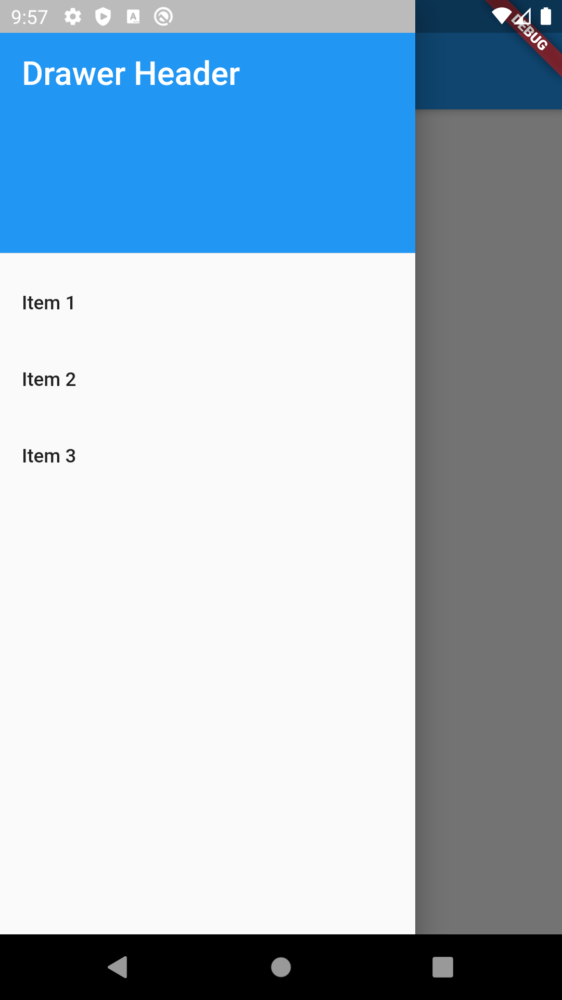
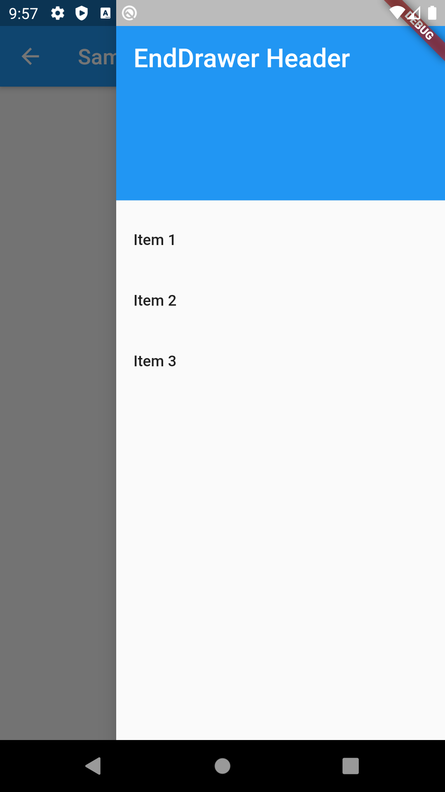
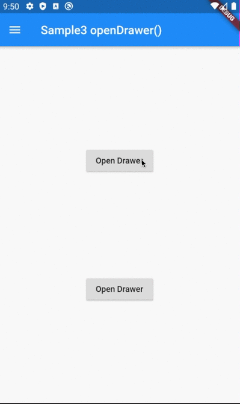
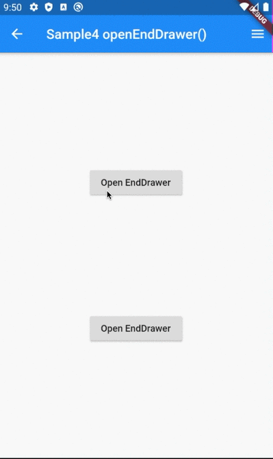

# Drawer

## Docs

[Drawer class](https://api.flutter.dev/flutter/material/Drawer-class.html)

[Add a Drawer to a screen | Cookbook](https://flutter.dev/docs/cookbook/design/drawer)

## Screenshots

|[Sample1](./lib/pages/sample1.dart)|[Sample2](./lib/pages/sample2.dart)|
|:-:|:-:|
|||

|[Sample3](./lib/pages/sample3.dart)|[Sample4](./lib/pages/sample4.dart)|
|:-:|:-:|
|||
