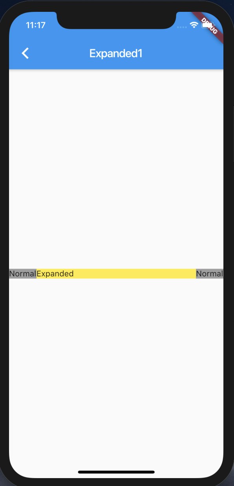
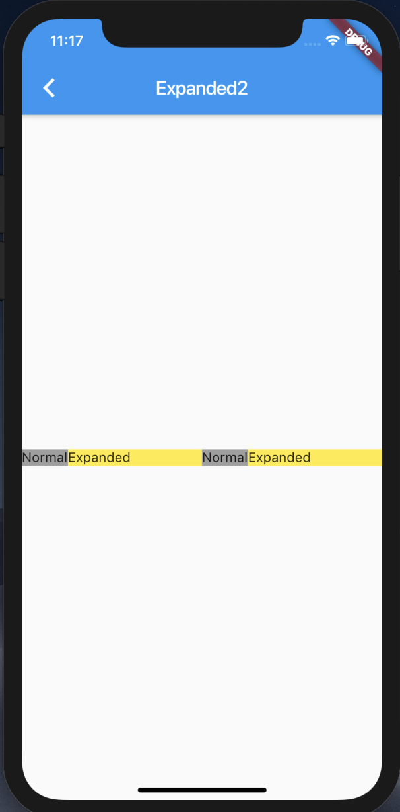
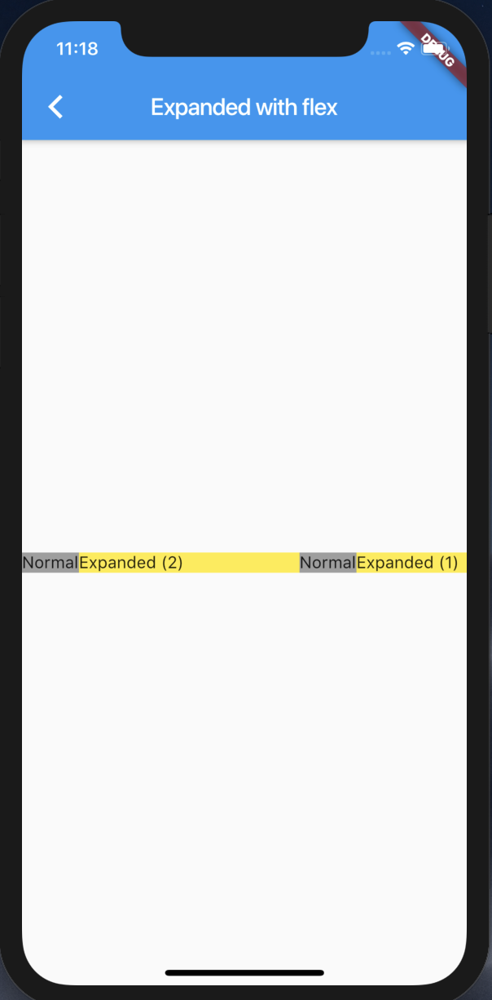
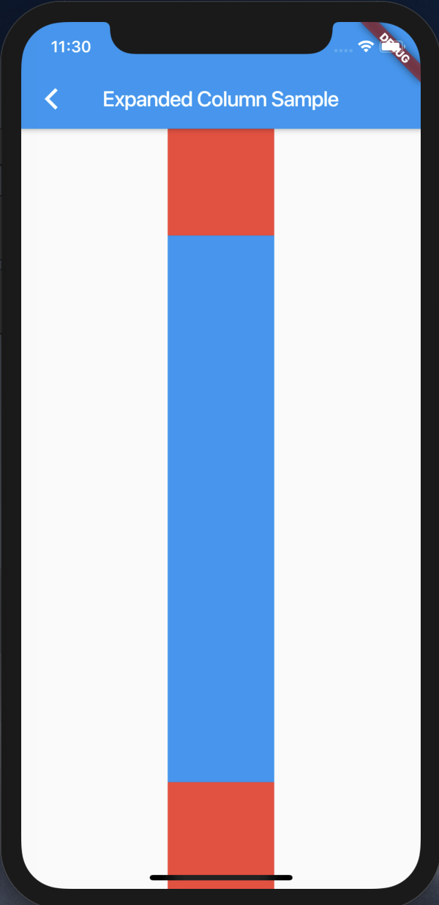
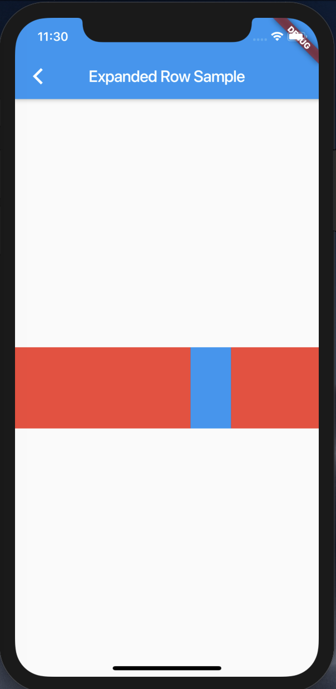

# Expanded

[Expanded class](https://api.flutter.dev/flutter/widgets/Expanded-class.html)

## Screenshots

|[Expanded1](lib/pages/expanded1.dart)|[Expanded2](lib/pages/expanded2.dart)|[Expanded with flex](lib/pages/expanded_with_flex.dart)|
|:-:|:-:|:-:|
||||

|[Sample1](lib/pages/sample1.dart)|[Sample2](lib/pages/sample2.dart)|
|:-:|:-:|
|||
