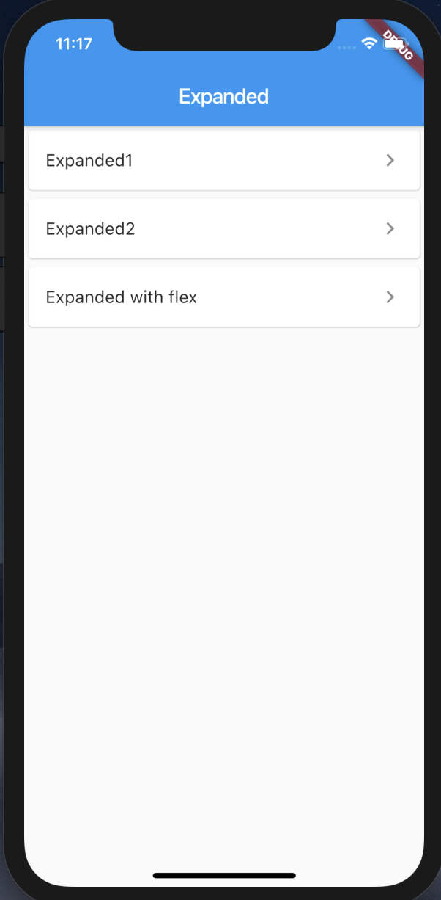

# Expanded

[Expanded class](https://api.flutter.dev/flutter/widgets/Expanded-class.html)

## Screenshots

Menu  

|Expanded1|Expanded2|Expanded with flex|
| ------- | ------- | ---------------- |
||||

|Sample1|Sample2|
| ------- | ------- |
|||