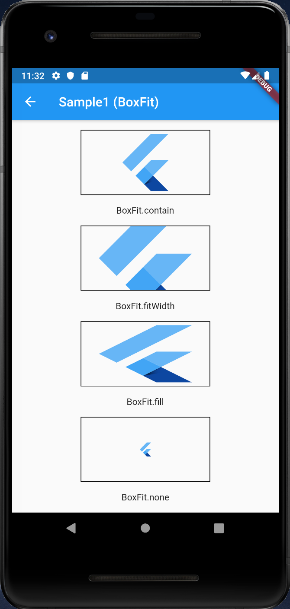
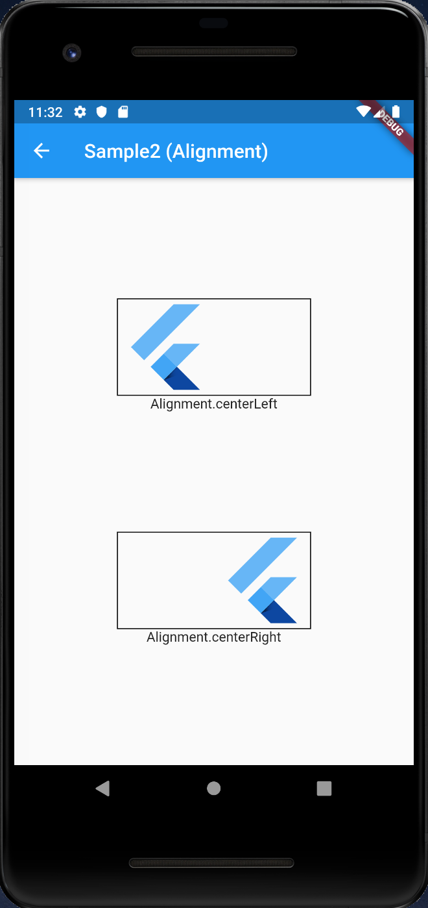
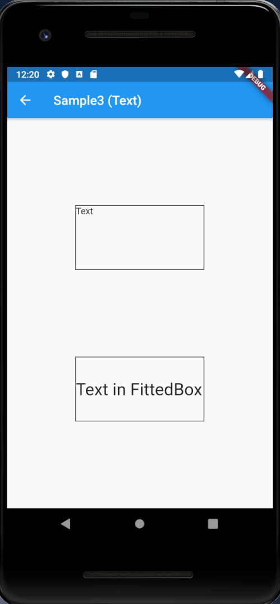

# FittedBox

## Docs

[FittedBox class](https://api.flutter.dev/flutter/widgets/FittedBox-class.html)

## Screenshots

|[Sample1 (BoxFit)](lib/pages/sample1.dart)|[Sample2 (Alignment)](lib/pages/sample2.dart)|[Sample3 (Text)](lib/pages/sample3.dart)|
|:-:|:-:|:-:|
||||
