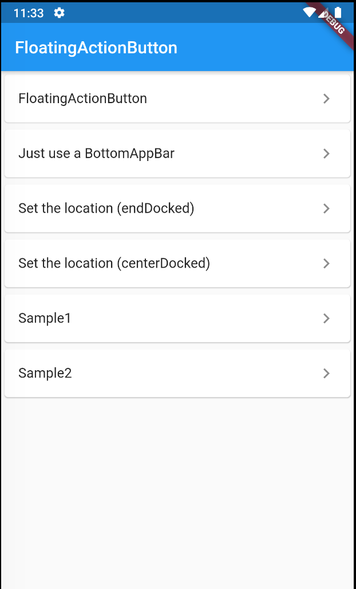
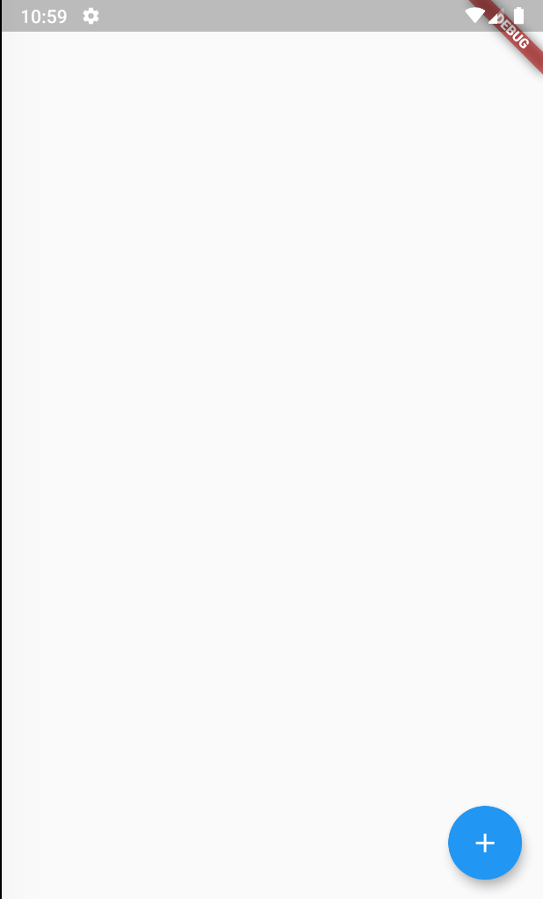
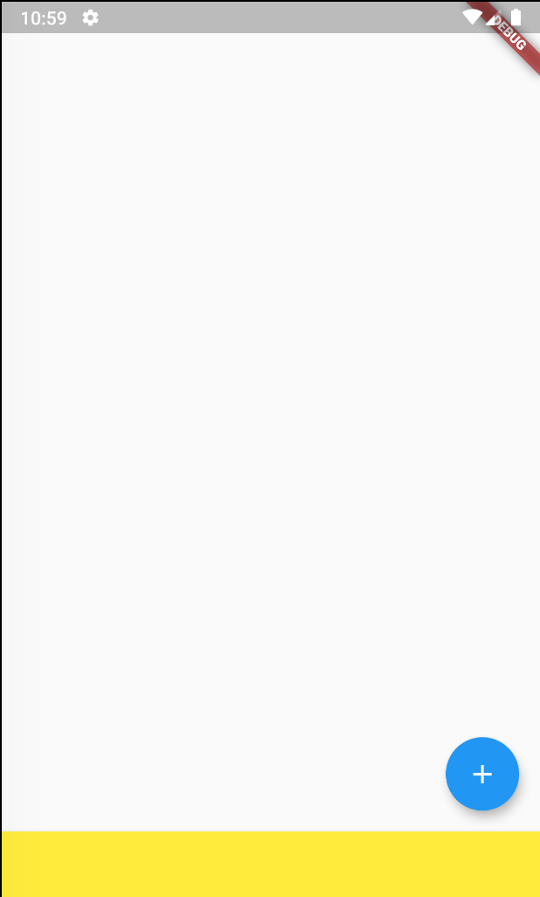
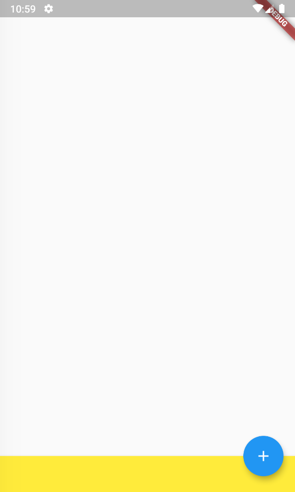
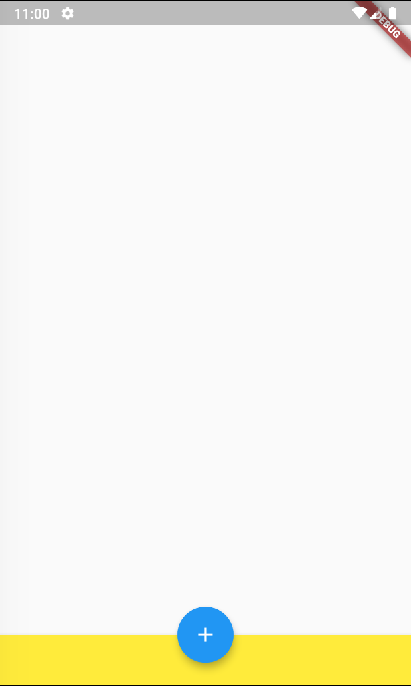
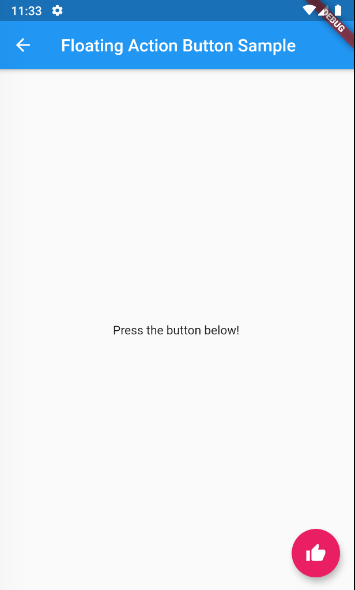
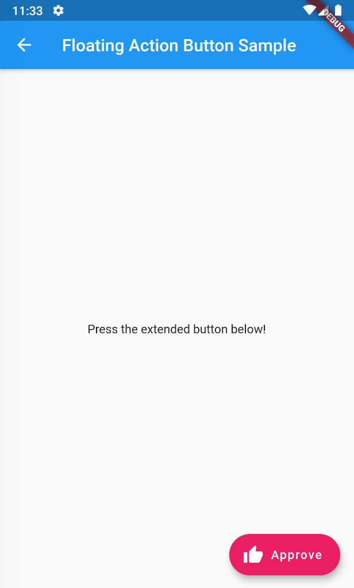

# floating_action_button

[FloatingActionButton class](https://api.flutter.dev/flutter/material/FloatingActionButton-class.html)

## Preview

Menu  

FAB  

BottomAppBar  

Set the location (endDocked)  

Set the location (centerDocked)  

Sample1  

Sample2  

