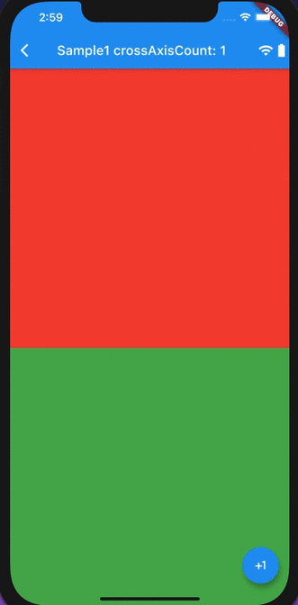
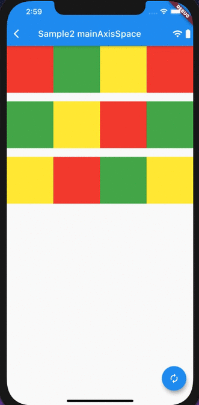
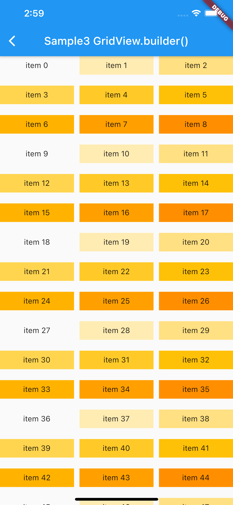
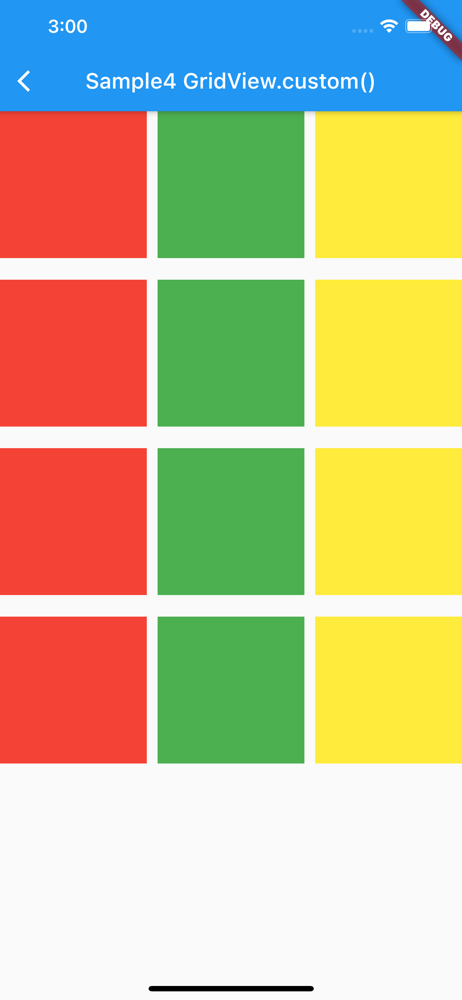
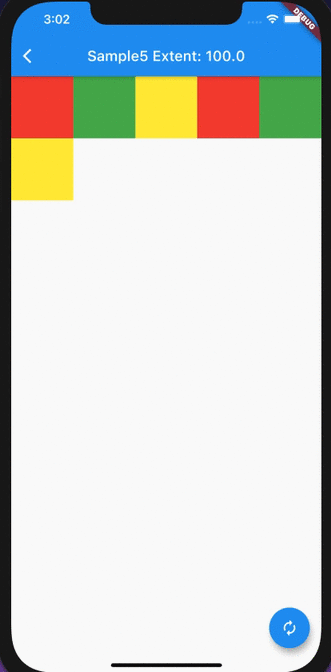
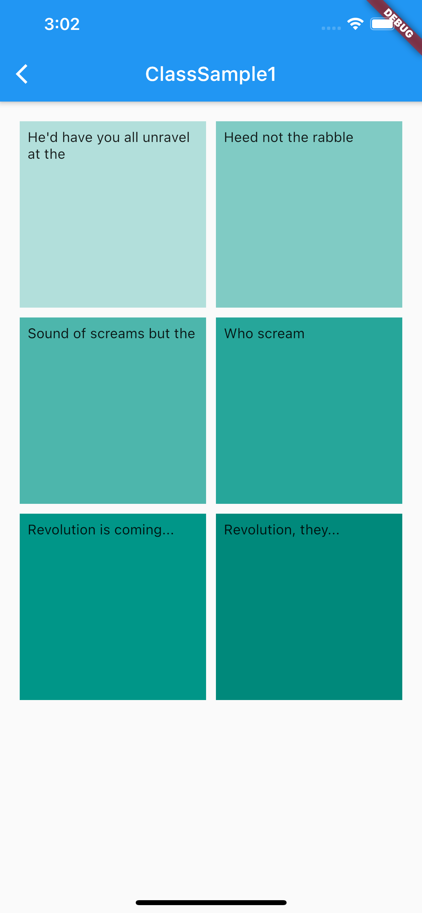

# GridView

## Docs

[GridView class](https://api.flutter.dev/flutter/widgets/GridView-class.html)

[GridView.count constructor](https://api.flutter.dev/flutter/widgets/GridView/GridView.count.html)

## Screenshots

|[Sample1](lib/pages/sample1.dart)|[Sample2](lib/pages/sample2.dart)|[Sample3](lib/pages/sample3.dart)|
|:-:|:-:|:-:|
||||

|[Sample4](lib/pages/sample4.dart)|[Sample5](lib/pages/sample5.dart)|[ClassSample1](lib/pages/class_sample1.dart)|
|:-:|:-:|:-:|
||||
