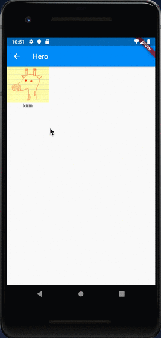
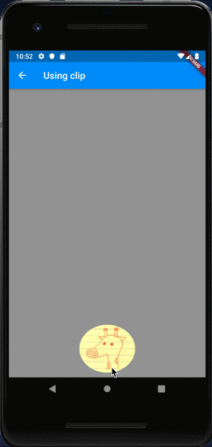

# Hero

## Docs

[Hero class](https://api.flutter.dev/flutter/widgets/Hero-class.html)

[Hero Animations](https://flutter.dev/docs/development/ui/animations/hero-animations)

## Screenshots

|[Hero](lib/pages/hero.dart)|[Using clip](lib/pages/using_clip.dart)|
|:-:|:-:|
|||
