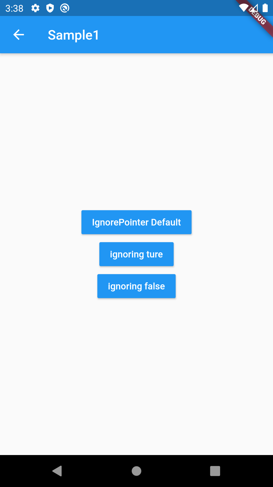

# IgnorePointer

## Docs

[IgnorePointer class](https://api.flutter.dev/flutter/widgets/IgnorePointer-class.html)

[DartPad](https://dartpad.dartlang.org/31b1984d77233ec770b73ad69ca9550b)

## Screenshots

|[Sample1](lib/pages/sample1.dart)|
|:-:|
||
