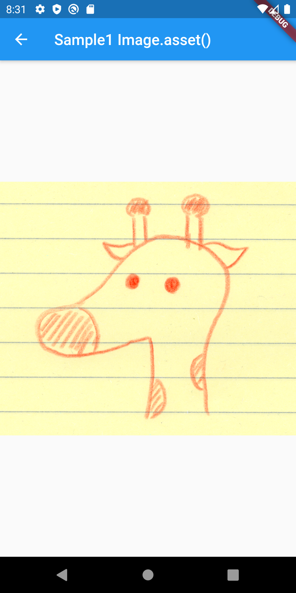
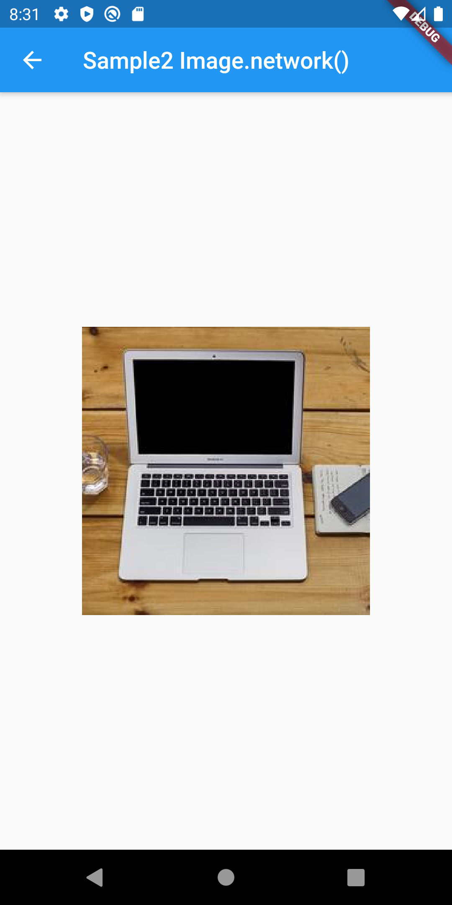
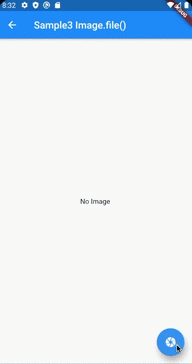
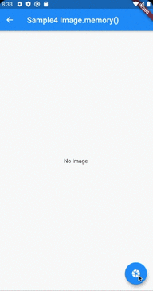
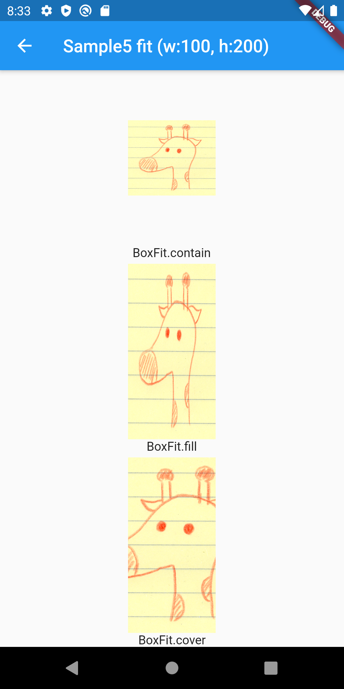
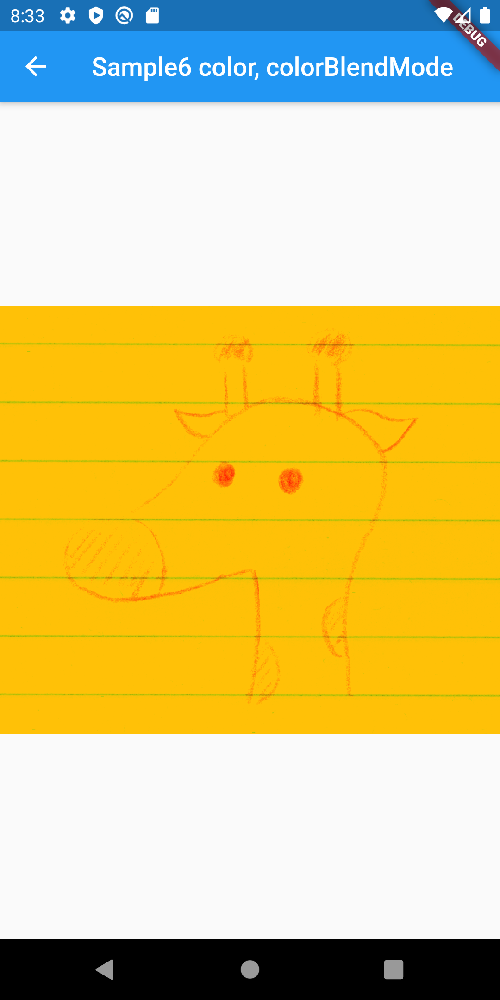

# Image class

## Docs

[Image class](https://api.flutter.dev/flutter/widgets/Image-class.html)

[Flutterでカメラ撮影](http://karmactonics.hatenablog.com/entry/2018/09/01/011255)

## Screenshots

|[Sample1 Image.asset()](./lib/pages/sample1.dart)|[Sample2 Image.network()](./lib/pages/sample2.dart)|[Sample3 Image.file()](./lib/pages/sample3.dart)|
|:-:|:-:|:-:|
||||

|[Sample4 Image.memory()](./lib/pages/sample4.dart)|[Sample5 fit](./lib/pages/sample5.dart)|[Sample6 color, colorBlendMode](./lib/pages/sample6.dart)|
|:-:|:-:|:-:|
||||

|[Sample7 semanticLabel](./lib/pages/sample7.dart)|
|:-:|
||
