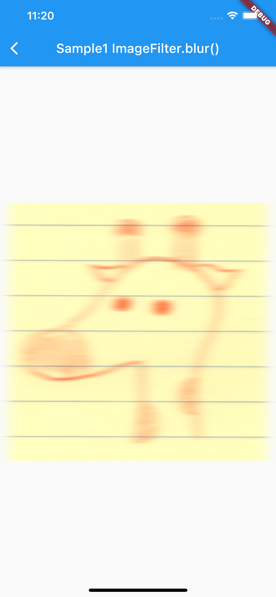
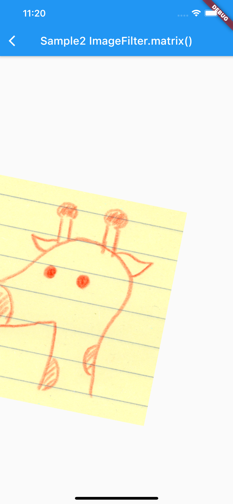
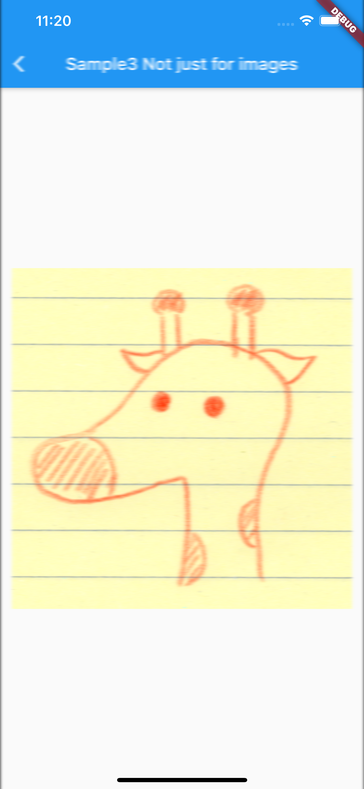

# ImageFiltered

## Docs

[ImageFiltered class](https://api.flutter.dev/flutter/widgets/ImageFiltered-class.html)

[BackdropFilter class](https://api.flutter.dev/flutter/widgets/BackdropFilter-class.html)

## Screenshots

|[Sample1](lib/pages/sample1.dart)|[Sample2](lib/pages/sample2.dart)|[Sample3](lib/pages/sample3.dart)|
|:-:|:-:|:-:|
||||
