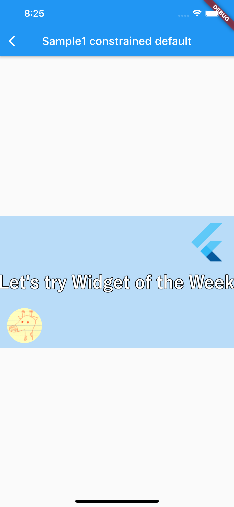
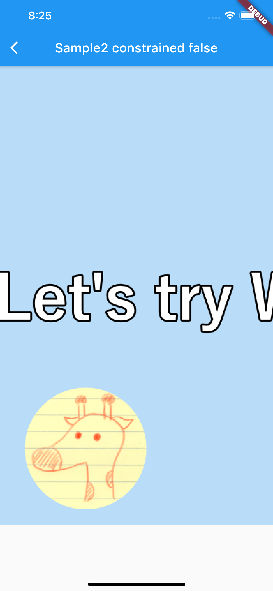

# InteractiveViewer

## Docs

[InteractiveViewer class](https://api.flutter.dev/flutter/widgets/InteractiveViewer-class.html)

## Screenshots

|[Sample1](lib/pages/sample1.dart)|[Sample2](lib/pages/sample2.dart)|[Sample3](lib/pages/sample3.dart)|
|:-:|:-:|:-:|
||||

|[ClassSample1](lib/pages/class_sample1.dart)|
|:-:|
||
