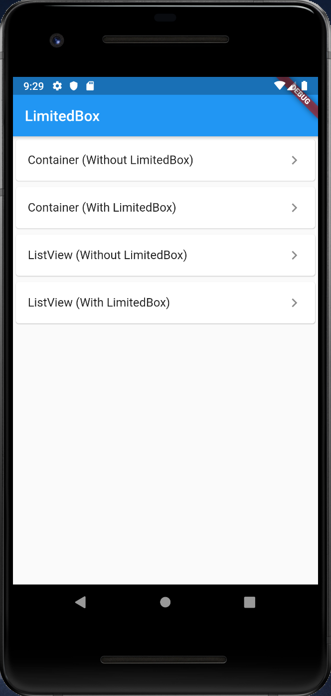
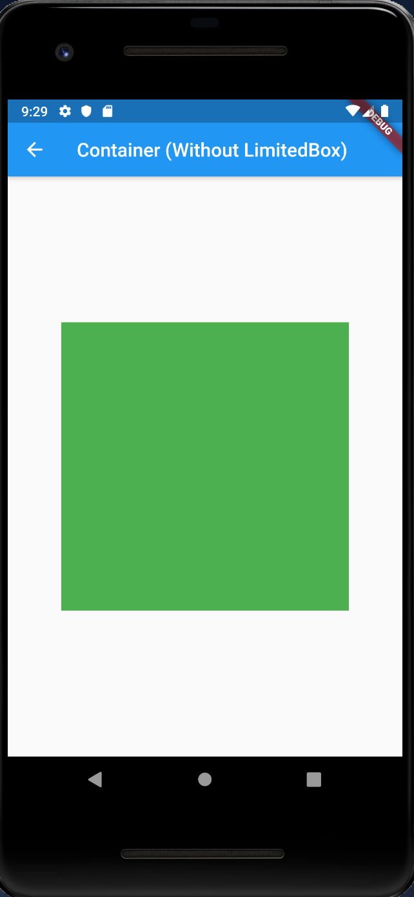
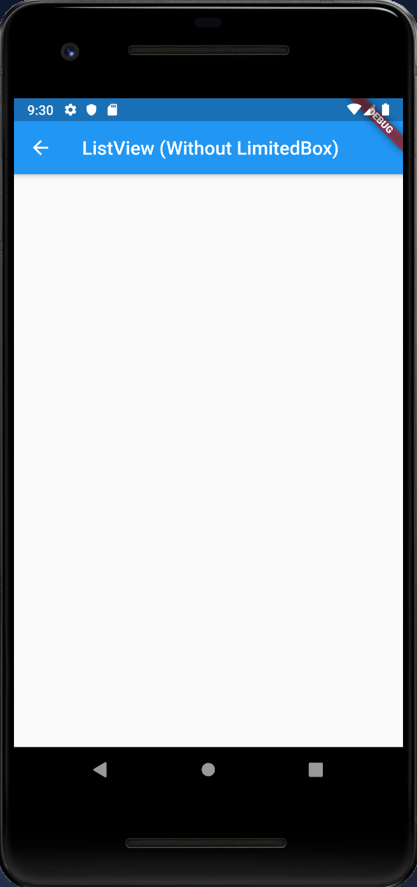
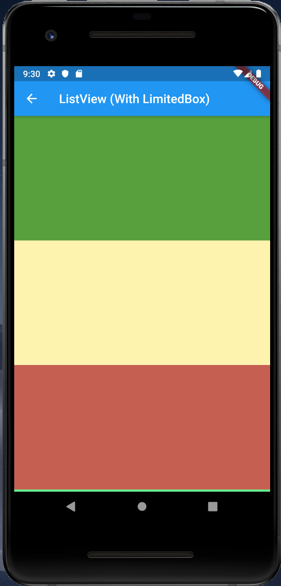

# LimitedBox

## Docs

[LimitedBox class](https://api.flutter.dev/flutter/widgets/LimitedBox-class.html)

## Screenshots

|Menu|Container (Without LimitedBox)|Container (With LimitedBox)|
|:-:|:-:|:-:|
|||Same as left|
||||

|ListView (Without LimitedBox)|ListView (With LimitedBox)|
|:-:|:-:|
||LimitedBox is working|
|||