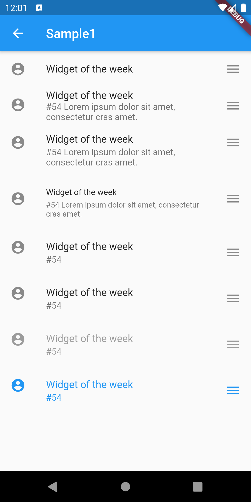
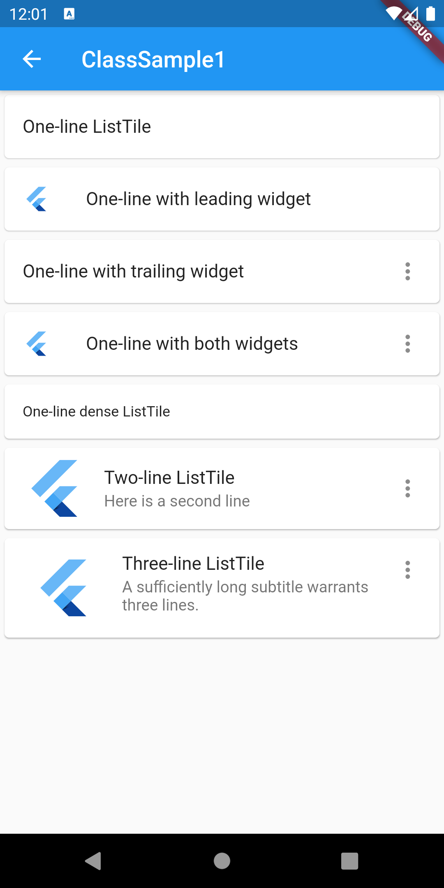
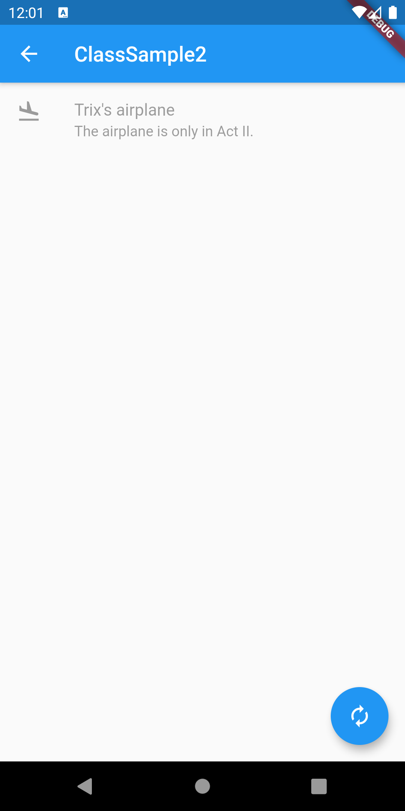
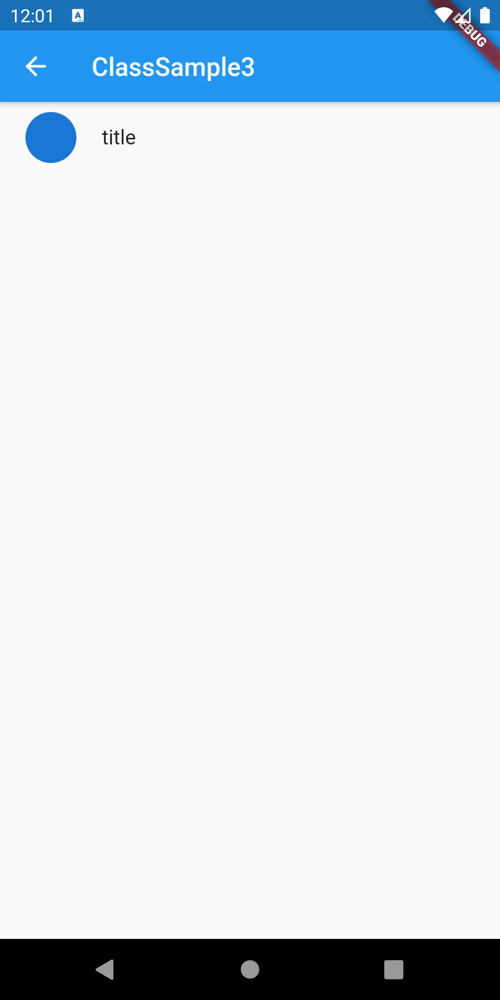
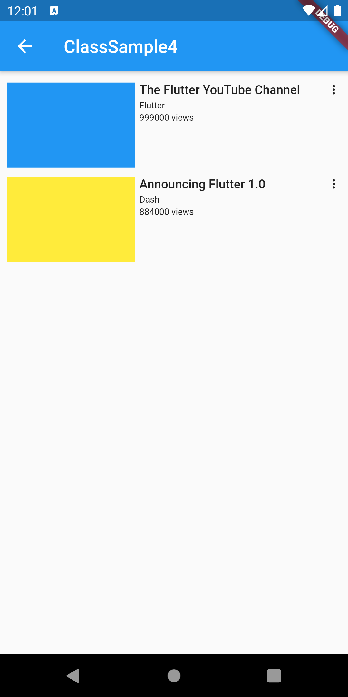
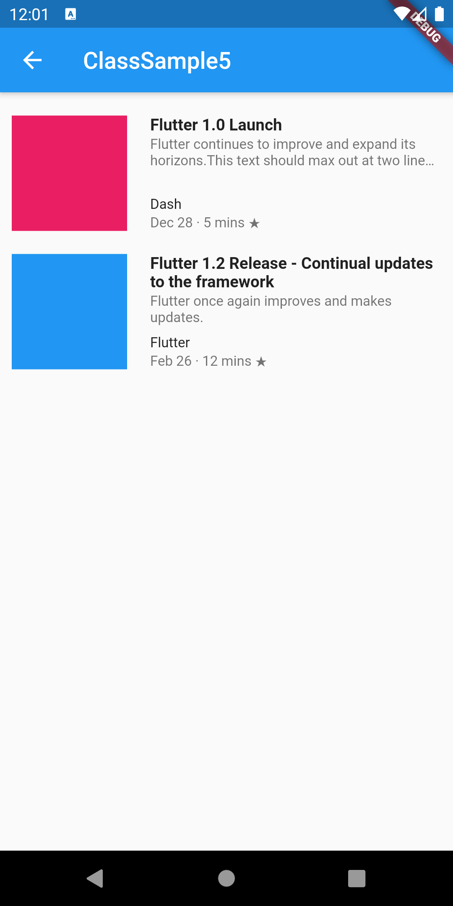

# ListTile

## Docs

[ListTile class](https://api.flutter.dev/flutter/material/ListTile-class.html)

## Screenshot

|[Sample1](lib/pages/sample1.dart)|
|:-:|
||

|[ClassSample1](lib/pages/class_sample1.dart)|[ClassSample2](lib/pages/class_sample2.dart)|[ClassSample3](lib/pages/class_sample3.dart)|
|:-:|:-:|:-:|
||||

|[ClassSample4](lib/pages/class_sample4.dart)|[ClassSample5](lib/pages/class_sample5.dart)|
|:-:|:-:|
|||
