# ListView

## Docs

[ListView class](https://api.flutter.dev/flutter/widgets/ListView-class.html)

## Screenshots

|[Sample1](lib/pages/sample1.dart)|[Sample2 scrollDirection](lib/pages/sample2.dart)|[Sample3 reverse: ture](lib/pages/sample3.dart)|
|:-:|:-:|:-:|
|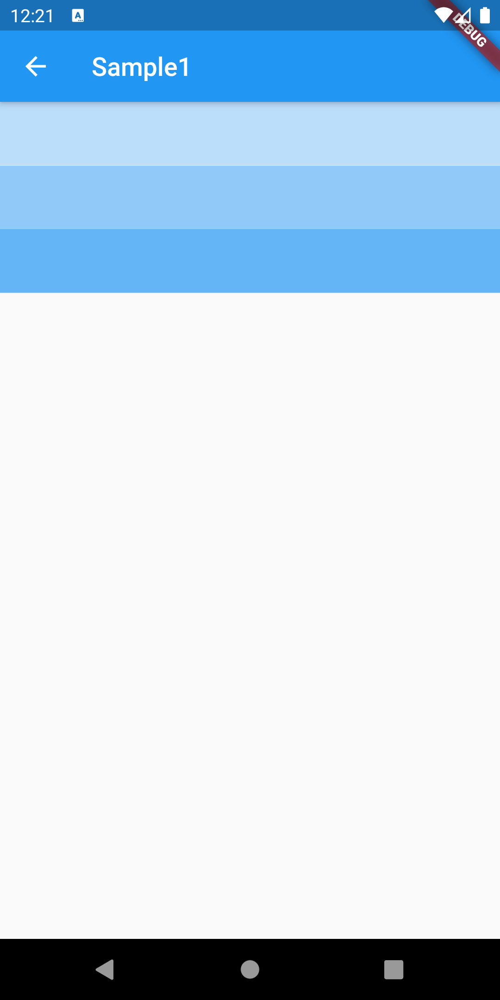|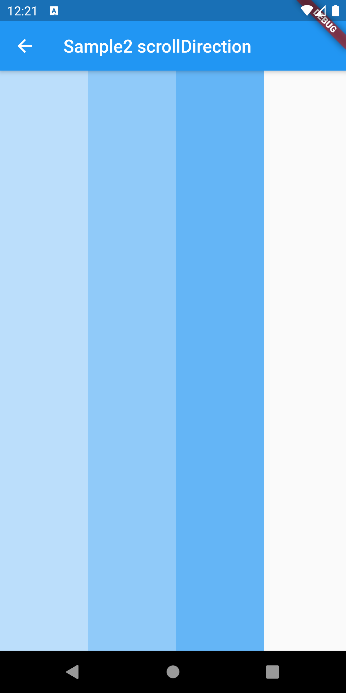|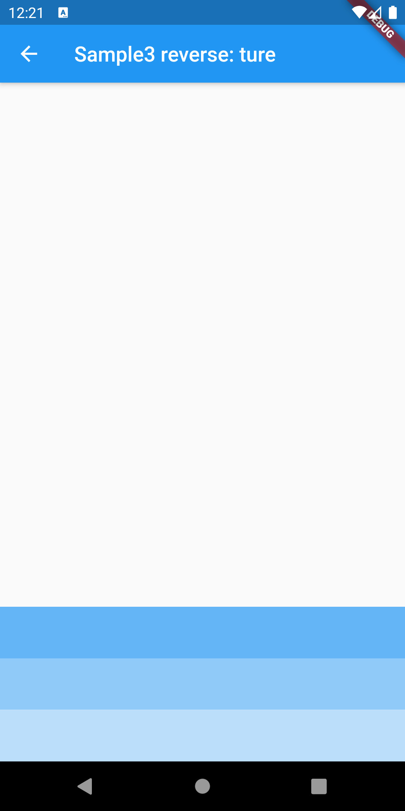|

|[Sample4 physics (NeverScroll)](lib/pages/sample4.dart)|[Sample5 ListView.builder()](lib/pages/sample5.dart)|[Sample6 ListView.separated()](lib/pages/sample6.dart)|
|:-:|:-:|:-:|
|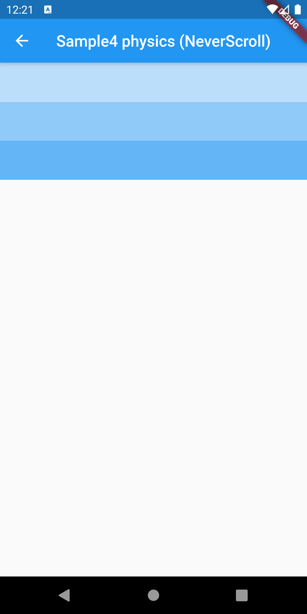|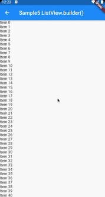|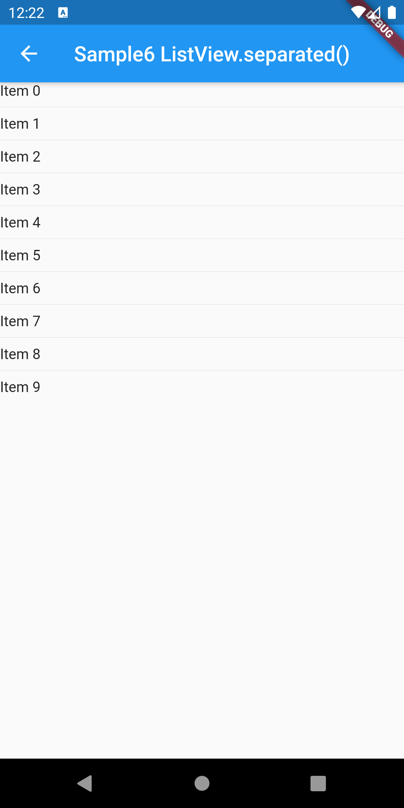|

|[Sample7 ListView.custom()](lib/pages/sample7.dart)|
|:-:|
|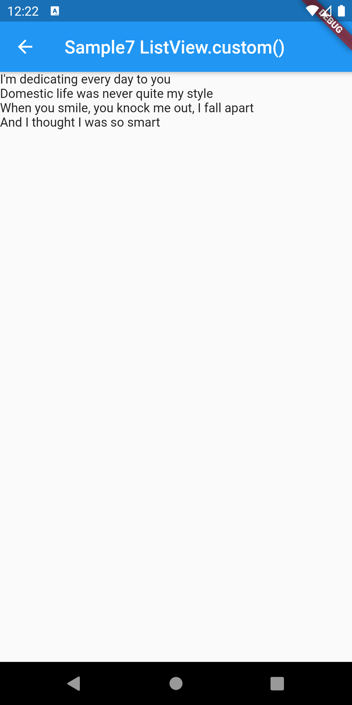|

|[ClassSample1 ListView()](lib/pages/class_sample1.dart)|[ClassSample2 ListView.builder()](lib/pages/class_sample2.dart)|[ClassSample3 ListView.separated()](lib/pages/class_sample3.dart)|
|:-:|:-:|:-:|
|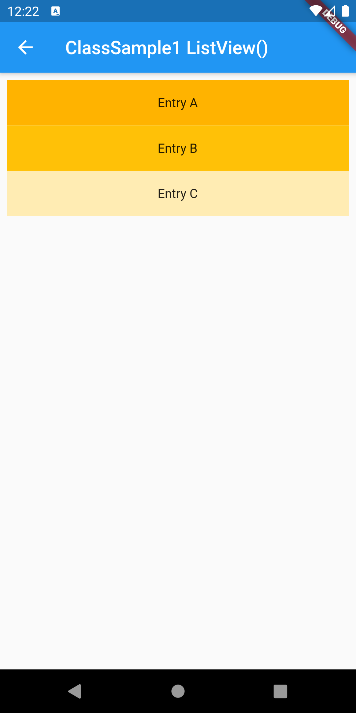|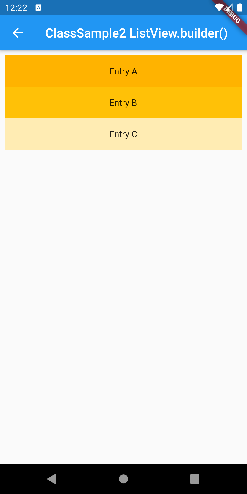|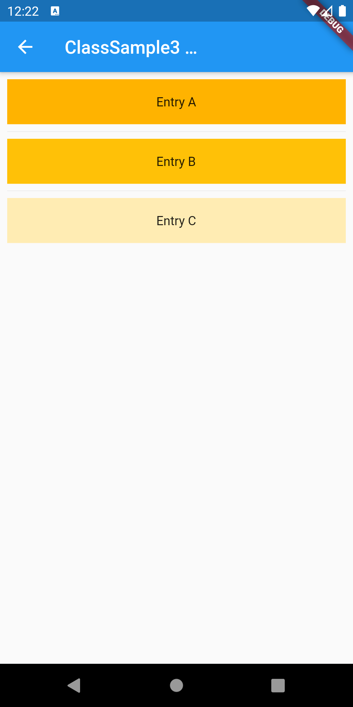|

|[ClassSample4 CustomScrollView](lib/pages/class_sample4.dart)|
|:-:|
|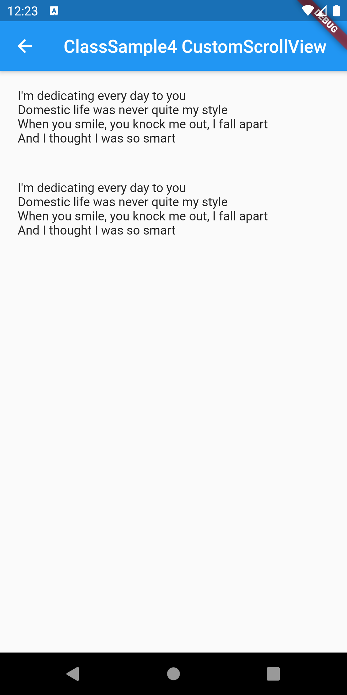|
