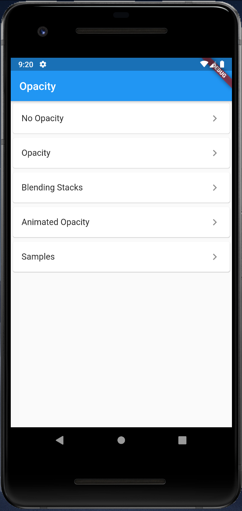
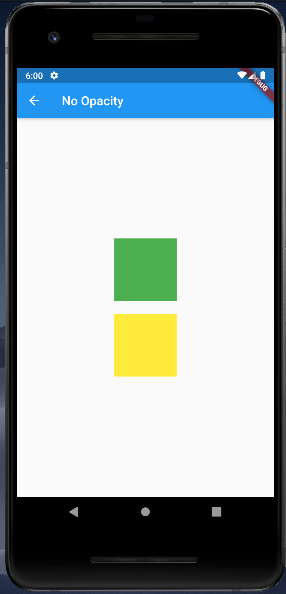
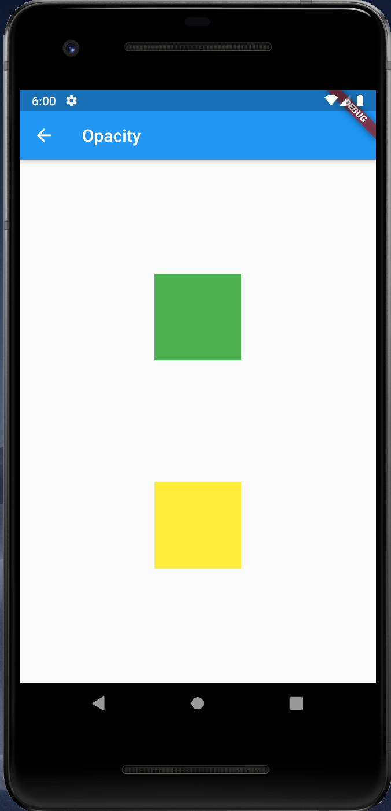
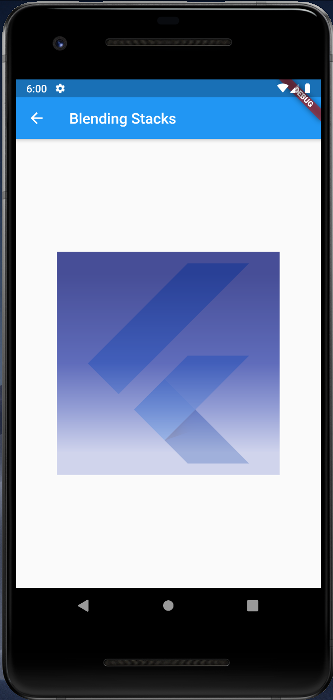
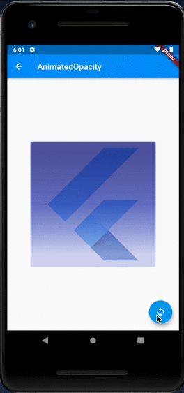
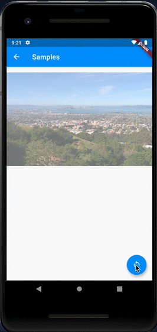

# Opacity

## Docs

[Opacity class](https://api.flutter.dev/flutter/widgets/Opacity-class.html)

[AnimatedOpacity class](https://api.flutter.dev/flutter/widgets/AnimatedOpacity-class.html)

## Screenshots

Menu  

|No Opacity|Opacity|
|-|-|
|||

|Blending Stacks|AnimatedOpacity|Samples|
|-|-|-|
||||
