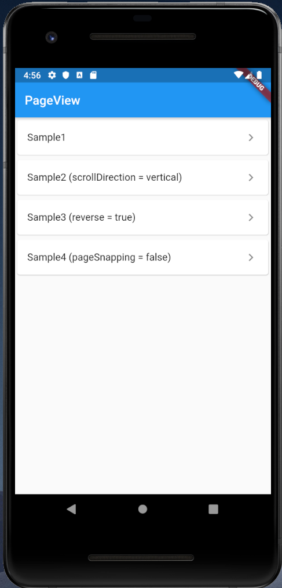
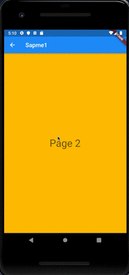
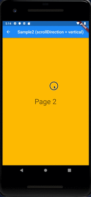
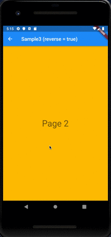
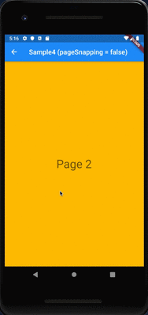

# PageView

## Docs

[PageView](https://api.flutter.dev/flutter/widgets/PageView-class.html)

[PageController](https://api.flutter.dev/flutter/widgets/PageController-class.html)

## Screenshots

|Menu|Sample1|Sample2 (scrollDirection = vertical)|
|:-:|:-:|:-:|
||||

|Sample3 (reverse = true)|Sample4 (pageSnapping = false)|
|:-:|:-:|
|||
