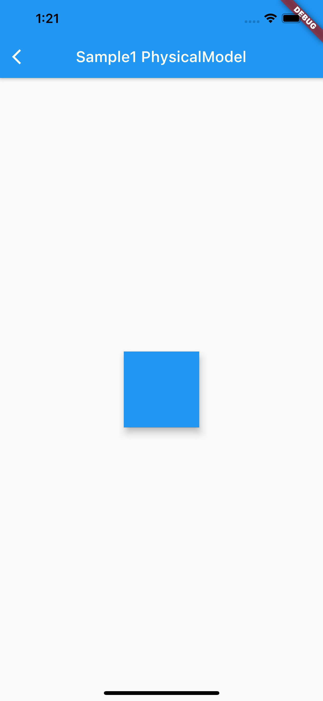
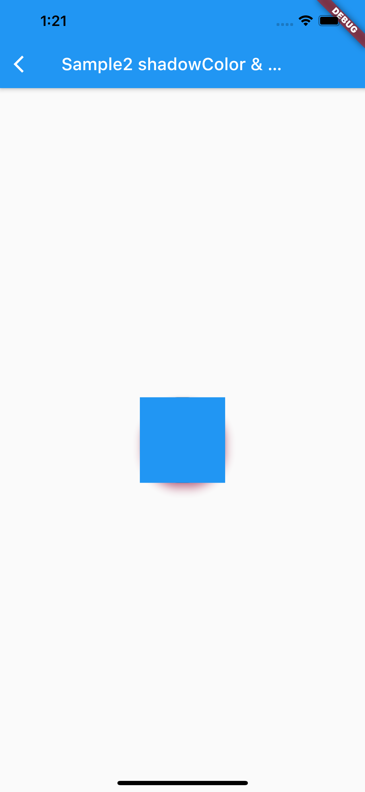
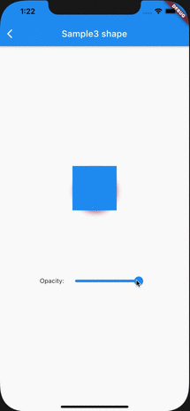

# PhysicalModel

## Docs

[PhysicalModel class](https://api.flutter.dev/flutter/widgets/PhysicalModel-class.html)

[DartPad](https://dartpad.dartlang.org/fa0a226e60003ab89757617e713a4ffb)

## Screenshots

|[Sample1](lib/pages/sample1.dart)|[Sample2](lib/pages/sample2.dart)|[Sample3](lib/pages/sample3.dart)|
|:-:|:-:|:-:|
||||
