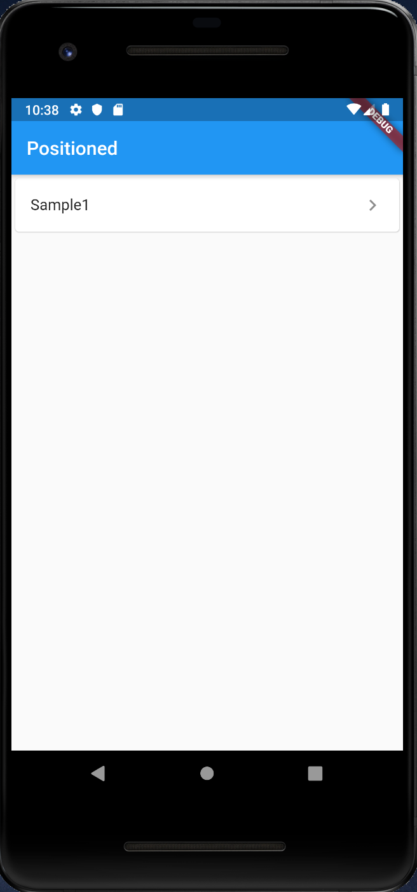
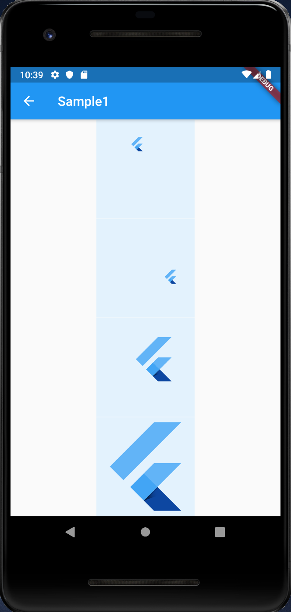

# Positioned

## Docs

[Positioned class](https://api.flutter.dev/flutter/widgets/Positioned-class.html)

[Layout widgets](https://flutter.dev/docs/development/ui/widgets/layout)

## Screenshots

|Menu|Sample1|
|:-:|:-:|
|||
