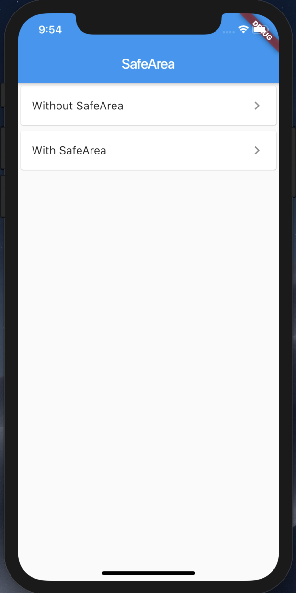
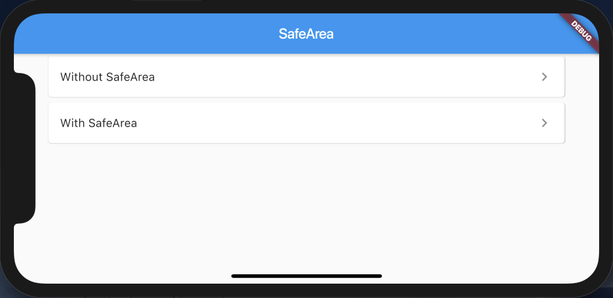

# SafeArea

## Link

https://api.flutter.dev/flutter/widgets/SafeArea-class.html

https://youtu.be/lkF0TQJO0bA

## ScreenShots

Menu  

|Without SafeArea|With SafeArea|
| -------------- | ----------- |
|||

Menu_landscape  

WithoutSafeArea_landscape  

WithSafeArea_landscape  

